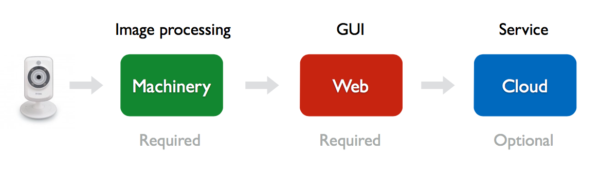

# Getting started

* [Why Kerberos.io](#why-kerberos-io)
* [What is Kerberos.io](#what-is-kerberos-io)
* [How does it work](#how-does-it-work)
* [Features](#features)

## Why Kerberos.io?

As burgalary is very common, we believe that video surveillance is a **trivial tool** in our daily lifes which helps us to **feel** a little bit more **secure**. Responding to this need, a lot of companies have started developing their own video surveillance software in the past few years.

Nowadays we have a myriad of **expensive** camera's, recorders and software solutions which are mainly **outdated** and **difficult** to install and use. Kerberos.io's goal is to solve these problems and to provide every human being in this world to have its own **ecological**, **affordable**, **easy-to-use** and **innovative** surveillance solution.

## What's Kerberos.io?

Kerberos.io is a **low-budget** video surveillance solution, that uses computer vision algorithms to detect changes, and that can trigger other devices. Kerberos.io is open source so everyone can customize the source code to its needs and share it with the community. When deployed on the Raspberry Pi, it has a **green footprint** and it's **easy to install**; you only need to transfer the [**Kerberos.io OS (KIOS)**](installation/KiOS) to your SD card and that's it.

<iframe src="https://player.vimeo.com/video/121532472?autoplay=0&color=943633" style="width:100%; height: 400px;" frameborder="0" webkitallowfullscreen mozallowfullscreen allowfullscreen></iframe>

## How does it work?

When installed Kerberos.io on a Raspberry Pi or local working station, two applications are available: the [**machinery**](https://github.com/kerberos-io/machinery) and the [**web**](https://github.com/kerberos-io/web).

The machinery is responsible for the processing. It's **an image processing framework** which takes images from the type of camera (USB-, IP- or RPi-camera) you've configured in the configuration files and executes one ore more algorithms and post-processes (e.g. save a snapshot). The configuration files allow you to define the type of camera, post-processes, conditions and much more; it's **highly configurable**. It's important to note that the machinery, out-of-the-box, can handle only one camera at a time.

The web is responsible for the visualization. It's a **GUI** which helps the user to find activity at a specific period, configure the machinery, view a live stream, see system information and much more. It's important to note that the machinery can work without the web, however we don't recommend this.

The cloud is an extra service, which is available by default but is not required. The main goal of this service is **to view your activity from everywhere** in the world. By [**subscribing to a plan**](https://cloud.kerberos.io), you can **sync your events** to the cloud application; you can sync **multiple instances** with only one subscription. 

To have a more detailed explanation go to the [**machinery**](machinery/introduction) and [**web**](web/introduction) pages.

## Features

Kerberos.io comes with **a bunch of features**, below you can find a short list of the most important ones.

 * Full range camera support (USB-, Raspberry Pi-, and IP-camera (RTSP or MJPEG)).
 * Constraints to make detection more intelligent (time interval, regions, etc).
 * Post-processes which are executed after a valid activity (GPIO pin, webhook, etc).
 * Live streaming (MJPEG) on the web or with another program like VLC or IP camera viewer.
 * Heatmap and latest sequence of activity.
 * Fluent and responsive overview of snapshots by day and hour.
 * System information (CPU, disk, network, etc).
 * View you activity everywhere with kerberos.io cloud.
 * ..
 
Features **NOT** included:

 * Video recording (only snapshots are taken); third-party solutions are available (IP camera viewer).
 * Multiple camera support; not supported out-of-the-box, but it's possible with some technical skills.