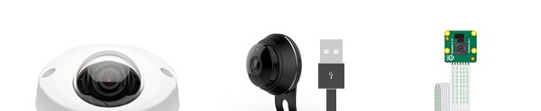

# Requirements

## Which type of machines can you use?

Kerberos.io runs on every Linux based machine but its main goal is to run on a Raspberry Pi or other boards due to its low energy consumption. We provide multiple ways (KIOS, Raspbian, Armbian, Docker, etc) to install Kerberos.io on the device your prefer. If you will install Kerberos.io with Docker, or on your local Linux machine, nothing special should be purchased except a video camera.

### Raspberry Pi 

We recommend to run Kerberos.io on a **Raspberry Pi**, as it is a very popluar microcontroller which can you buy in almost every (online) electronic shop. To simplify the lives of our Raspberry Pi users, Kerberos.io comes with a custom ARM OS called [**KIOS**](installation/KiOS) (Kerberos.io Operating System), which you can deploy to your Raspberry Pi in just a few minutes. Kerberos.io supports **all Raspberry Pi versions** (1, 2, 3 and Zero). 

### What about other boards?

Kerberos.io can also be installed on other boards by following the [**Armbian**](/installation/armbian) installation. At the moment of writing we don't have support for KiOS, so the installation is a little bit harder. This is a short list of microcontrollers on which we have tested Kerberos.io using the Armbian OS:

 * PCDuino3 Nano (Allwinner A20)
 * Orange Pi + (Allwinner H3)

## Which type of camera can you use?

Kerberos.io works with the full range of camera's. You can use an **USB-**, **IP-** or the **Raspberry Pi camera (v1.3 and v2.1)**. If you want to use an IP camera, we recommend to use the RTSP connection if available; note that it's possible that cheap IP cameras will not work properly.

