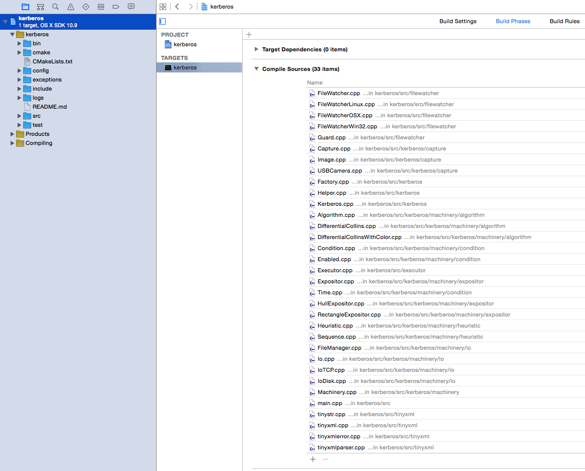
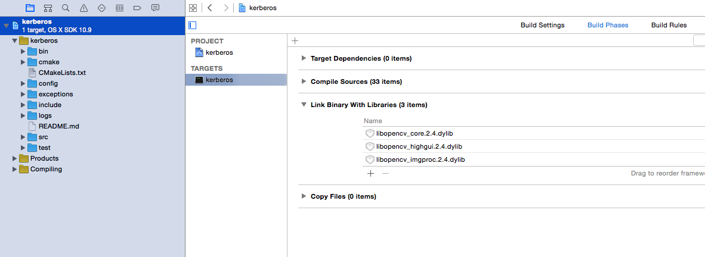

# Contribute

* [Versioning](#versioning)
* [CMake](#cmake)
	* [CMake setup](#cmake-setup)
		* [Src folder](#src-folder)
		* [CMake folder](#cmake-folder)
* [Setup kerberos in your IDE](#setup-kerberos-in-your-ide)
	* [OSX](#osx)
		* [Create a new XCode project](#create-a-new-xcode-project)
		* [Compile source with CMake](#compile-source-with-cmake)
		* [Link headers and libraries](#link-headers-and-libraries)
		* [Add source to project](#add-source-to-project)
		* [Select libraries](#select-libraries)
		* [Specifiy header- and library locations](#specify-header-and-library-locations)
	* [Linux](#linux)
* [Adding a new class](#adding-a-new-class)
	* [Create the header file](#create-the-header-file)
	* [Create the source file](#create-the-source-file)
	* [Modify the CMakeLists.txt file](#modifile-the-cmakelists-file)
	* [Create a new entry in the config file](#create-a-new-entry-in-the-config-file)
	* [Compile](#compile)
* [Adding a test](#adding-a-test)
	* [Create the test file](#create-the-test-file)

This documents describes how to contribute to the machinery and describes all the technical stuff you will need to know. If you want to contribute you will need to install the source code on your local environment.

## Versioning

The source is managed on [Github](https://github.com/kerberos-io), and thus we are using git as our version control. For simplicity we are using following [branching model](http://nvie.com/posts/a-successful-git-branching-model/). The model includes:

* main branch
* develop branch
* hotfix and release branches

If you are a new developer, fork the development branch and send a pull request.

## CMake

As mentioned before on the *installation* page, the machinery is using CMake. Therefore if you want to compile the source code, you will need to have installed CMake first. When executing the **CMake** command, CMake will create the appropriate makefiles to compile the machinery.

### CMake setup

At the root of the project you will find the main CMakeList.txt file, and this is where everything starts. The root CMake file will include all the other CMake files; which are located in the *src* and *cmake* folder.

#### Src folder

The *src* folder includes the machinery. You will find a CMakeLists.txt file in the folder and every subfolder. The CMakeLists.txt is reponsible for the directory it belongs to and will contain all the necesarry commands.

#### CMake folder

The *CMake* directory in the root folder, contains the cmakefiles that will download all the dependencies. The CMake files describe where the dependencies are located (Github, SVN, etc.) but also how they need to be build, configured and/or installed.

## Setup kerberos in your IDE

### OSX

OSX users can use the XCode IDE to contribute to the machinery. The only hard thing will be to setup the XCode configuration files; to indicate where the headers can be found and where the dynamic libraries are located.

#### Create a new XCode project

First we will create a new XCode C++ project and checkout the machinery from [Github](https://github.com/kerberos-io).

#### Compile source with CMake

Once the project has been setup, we will compile the source code with CMake. Open a terminal and go to the root of the project, enter following command.

	mkdir build && cd build && cmake .. && make

#### Link headers and libraries

When the source has been compiled succesfully we will modify the XCode configuration of the machinery. Therefore we will need to do three things: include the header directories, link the libraries and include the source files.

##### Add source to project

Select all the source files in the **/src** directory, and drag-and-drop them in the *Compile Sources* section.

##### Select libraries

Select all the libraries in the **/build/thirdparty/lib** directory, and drag-and-drop them in the *Link Binary With Libraries* section.

##### Specifiy header- and library locations

Click on the project name and select the *Build Settings* page, search for the keyword **search**.

Define the header search paths.

Define the library search paths.

### Linux

The idea is the same as the installation for OSX, so first you will need to checkout the source code and compile it with the one liner below.

	mkdir build && cd build && cmake .. && make

For the time being I didn't had the time to find a good IDE for Linux and to experiment with it. So if someone else could complete the documentation for Linux environments that would be great!

## Adding a new class

This paragraph will tell you how to create a new condition, algorithm, expositor, io or capture device. For simplicity we will show how to create a new algorithm; the steps are identical if you want to create for example a new capture device; only the directory will differ.

### Create the header file

First we will need to create a new header file in the *include/kerberos/machinery/algorithm* directory. You can copy an existing algorithm header file, and start from that. You will end up with the following header file:

	//
	//  Class: AnotherAlgorithm
	//  Description: Another algorithm
	//  Created:     ...
	//  Author:      ...
	//  Mail:        ...
	//  Website:     ...
	//
	//  The copyright to the computer program(s) herein
	//  is the property of kerberos.io, Belgium.
	//  The program(s) may be used and/or copied .
	//
	/////////////////////////////////////////////////////

	#ifndef __AnotherAlgorithm_H_INCLUDED__   // if AnotherAlgorithm.h hasn't been included yet...
	#define __AnotherAlgorithm_H_INCLUDED__   // #define this so the compiler knows it has been included

	#include "machinery/algorithm/Algorithm.h"

	namespace kerberos
	{
    	char AnotherAlgorithmName[] = "AnotherAlgorithm";
    	class AnotherAlgorithm : public AlgorithmCreator<AnotherAlgorithmName, AnotherAlgorithm>
    	{
        	private:
        		Image m_result;
            	int m_parameter;

        	public:
            	AnotherAlgorithm(){}
            	void setup(const StringMap & settings);
       
            	void initialize(ImageVector & images);
            	Image evaluate(ImageVector & images, JSON & data);
            	void setParameter(int parameter);
    	};
	}
	#endif

When creating a new class you will need to inherit from it corresponding creator, for the algorithm example: AlgorithmCreator. The creator class requires two template parameters. The first one is a unqie name for the class, this name will be used to make some kind of dependency injection possible. We will use the name to setup the configuration files, and to use it to select a specific class. The second parameter is the class itself.

The inheritance of the creator class can be a little bit strange, but it is required and needed to register the class automatically with the factory. When the code gets compiled, the classes will be automatically registered with the factory, and you can create instances of those classes by using the name we've defined in the first template parameter. For example we could create a new instance of our previously created class with the following command.

	Algorithm * anotherAlgorithm = Factory<Algorithm>::getInstance()->create("AnotherAlgorithm");

### Create the source file

Ofcourse we also need to have an implementation file, therefore we need to create a new source file in the *src/kerberos/machinery/algorithm* directory. Just like the previous example, you can copy an existing class and implement the member functions you've declared in the header file. An example would be:

	#include "machinery/algorithm/AnotherAlgorithm.h"

	namespace kerberos
	{
	    void AnotherAlgorithm::setup(const StringMap & settings)
	    {
	        Algorithm::setup(settings);
	        int parameter = std::atoi(settings.at("algorithms.AnotherAlgorithm.parameter").c_str());
	        setParameter(parameter);
	    }
	    
	    void AnotherAlgorithm::initialize(ImageVector & images)
	    {
	        ....
	    }

	    Image AnotherAlgorithm::evaluate(ImageVector & images, JSON & data)
	    {
	    	Image evaluation;

	    	... do something ..
	        
	        return evaluation;
	    }

	    void AnotherAlgorithm::setParameter(int parameter)
	    {
	    	m_parameter = parameter;
	    }
	}

### Modify the CMakeLists.txt file

Open the CMakeLists.txt in the *src/kerberos* directory file and append the name of the algorithm class to the *KERBEROS_FACTORY_ENTITIES* variable; for example *machinery/algorithm/AnotherAlgorithm.cpp*.

	# -------------------------------------------------------
	# Entities that have to be registered with the factory
	#   - classes are registered on compile time, so they
	#   don't belong to a library. New algorithms, expositors
	#   or Io classes belong here.

    set(KERBEROS_FACTORY_ENTITIES
        capture/USBCamera.cpp
        machinery/condition/Time.cpp
        machinery/condition/Enabled.cpp
        machinery/algorithm/DifferentialCollins.cpp
        machinery/algorithm/DifferentialCollinsWithColor.cpp
        machinery/algorithm/AnotherAlgorithm.cpp
        machinery/expositor/RectangleExpositor.cpp
        machinery/expositor/HullExpositor.cpp
        machinery/heuristic/Sequence.cpp
        machinery/io/IoDisk.cpp
        machinery/io/IoTCP.cpp
        machinery/io/IoMongoDB.cpp
    )

### Create a new entry in the config file

Open the algorithm.xml file in the **config** directory, and add a new tag with exactly the same name you've used in the header file; so in our example "AnotherAlgorithm". Within the new tag we can add properties that we will be use to configure our algorithm, in our example we defined a field **parameter** so we can add this field in the config file. 

One thing you will need to do is to attach a **type** to a property. The type will be used by the web interface to automatically render the properties. For simplicity we can use the type number, this will show an input box on the settings page of the web interface where we are able to add numbers.

	<algorithms>

		<AnotherAlgorithm>
			<parameter type="number">5</parameter>
	    </AnotherAlgorithm>
	    
	</algorithms>

You can retrieve the parameter in the **setup** function with the settings parameter.

	settings.at("algorithms.AnotherAlgorithm.parameter")

### Compile

Hurray, we've made it! So now you can compile the code again, and if you're using an IDE don't forget to include the new source file! However if you are compiling from the commandline you just have to go to the build folder and write **make**.

## Adding a new test

When someone adds a class for a new io device, algorithm or expositor, he/she will need to write some documentation about the class but also need to provide some unit tests. This paragraph will provide you how to write a simple test.

### Create the test file

Add a new file to the **test/** directory, prefix the file with *test_* e.g. test_condition_enabled.cpp. Include the *gtest* and *gmock* headers; and also the Factory and Type headers. Write a new test condition, this is where the assert will be executed.

	#include "gtest/gtest.h"
	#include "gmock/gmock.h"
	#include "Factory.h"
	#include "Types.h"

	using ::testing::AtLeast;
	using ::testing::Return;
	using namespace kerberos;

	// ----------------------------------------
	// Enabled condition: allowed function

	TEST(ENABLED_CONDITION, ALLOWED)
	{
	    Condition * condition = Factory<Condition>::getInstance()->create("Enabled");

	    // This is only for mocking
	   	ImageVector images;

	    StringMap settings;
	    settings["conditions.Enabled.delay"] = "2000";

	    // Enable condition
	    settings["conditions.Enabled.active"] = "true";
	    condition->setup(settings);
	    bool canExecute = condition->allowed(images);
	    EXPECT_EQ(true, canExecute);

	    // Disable condition
	    settings["conditions.Enabled.active"] = "false";
	    condition->setup(settings);
	    canExecute = condition->allowed(images);
	    EXPECT_EQ(false, canExecute);
	}	

### Run tests

To execute the test you can run the **make check** in the **build/** directory. When you've added a new test file, you will need to execute the **cmake** command again. 

	cd build/
	cmake ..
	make check

You will get following output

	macbook:build cedricverstraeten$ make check
	[  1%] Built target EXECUTOR_LIBRARY
	[  8%] Built target TINYXML_LIBRARY
	[ 16%] Built target FILEWATCHER_LIBRARY
	[ 29%] Built target opencv
	[ 49%] Built target KERBEROS_CORE
	[ 62%] Built target googletest
	[ 75%] Built target googlemock
	[100%] Built target kerberos-test
	[==========] Running 6 tests from 5 test cases.
	[----------] Global test environment set-up.
	[----------] 1 test from ENABLED_CONDITION
	[ RUN      ] ENABLED_CONDITION.ALLOWED
	[       OK ] ENABLED_CONDITION.ALLOWED (2002 ms)
	[----------] 1 test from ENABLED_CONDITION (2002 ms total)

	[----------] 2 tests from HELPER
	[ RUN      ] HELPER.T_TO_STRING
	[       OK ] HELPER.T_TO_STRING (0 ms)
	[ RUN      ] HELPER.NORMALIZE_PATH
	[       OK ] HELPER.NORMALIZE_PATH (0 ms)
	[----------] 2 tests from HELPER (0 ms total)

	[----------] 1 test from HULL_EXPOSITOR
	[ RUN      ] HULL_EXPOSITOR.CALCULATE
	[       OK ] HULL_EXPOSITOR.CALCULATE (1 ms)
	[----------] 1 test from HULL_EXPOSITOR (1 ms total)

	[----------] 1 test from RECTANGLE_EXPOSITOR
	[ RUN      ] RECTANGLE_EXPOSITOR.CALCULATE
	[       OK ] RECTANGLE_EXPOSITOR.CALCULATE (0 ms)
	[----------] 1 test from RECTANGLE_EXPOSITOR (0 ms total)

	[----------] 1 test from SEQUENCE_HEURISTIC
	[ RUN      ] SEQUENCE_HEURISTIC.IS_VALID
	[       OK ] SEQUENCE_HEURISTIC.IS_VALID (1005 ms)
	[----------] 1 test from SEQUENCE_HEURISTIC (1005 ms total)

	[----------] Global test environment tear-down
	[==========] 6 tests from 5 test cases ran. (3008 ms total)
	[  PASSED  ] 6 tests.
	[100%] Built target check
	macbook:build cedricverstraeten$ 