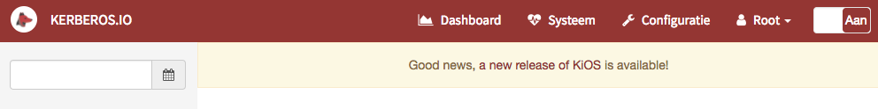
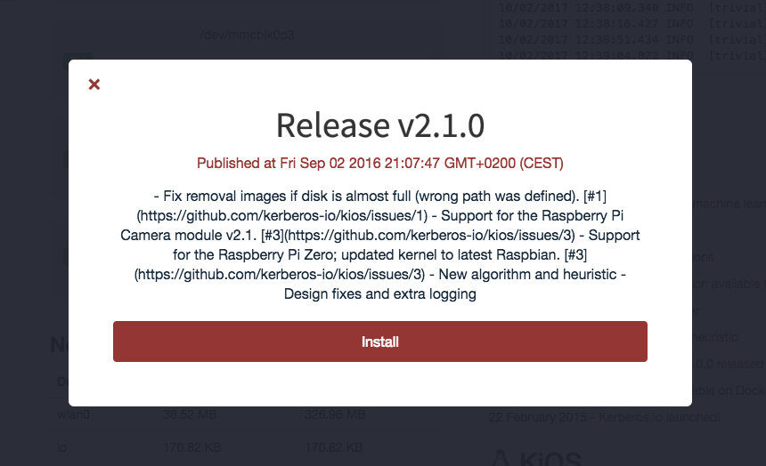

# Upgrade

To upgrade Kerberos.io to a new version you should **follow the approach which fits your initial installation** method. If you installed KiOS follow the KiOS upgrade procedure, if installed on Raspbian follow the Raspbian upgrade procedure, etc.

Please note that it might be possible that some new files are added or existing files were updated. To make sure everything works as expected, you should **clear your browser cache**.

## KiOS

If you installed KiOS, you can **use the built-in versioning** method. You can find the versioning at the bottom of the system page. If a new version of Kerberos.io is released, you'll see a new version available. Note that you'll also receive **a notification on top of the Kerberos.io web interface**, when a new release is available.

### Start an upgrade

When a new release is available, you have the possibilty to **install** it **by clicking on** the name of **the release**. A popup will open giving you some more information about the release. Press the install button to start the upgrade. Make sure that you **don't close the upgrade screen** while upgrading.

This is what will happen:

* New KiOS image is downloaded.
* Release is unpacked and transferred to /root partition.
* Systems is rebooted.
* Post-upgrade scripts are applied.

## Raspbian / Armbian

If you want to install a new version of Kerberos.io on Raspbian or Armbian, there is **no automated versioning** process available like KiOS. To perform an upgrade you'll need to follow the traditional installation procedure for [Raspbian**](/installation/Raspbian) or for [**Armbian**](/installation/Armbian).

Please read the notes below that matches your current and desired version to upgrade to. If no notes are available, you'll only need to follow the installation guide.

Install PHP7 packages.

    sudo apt-get install php7.0 php7.0-curl php7.0-gd php7.0-fpm php7.0-cli php7.0-opcache php7.0-mbstring php7.0-xml php7.0-zip php7.0-mcrypt

Modify the fastcgi_pass parameter in your nginx config.

		sudo nano /etc/nginx/sites-enabled/default

Replace following line.

		- fastcgi_pass unix:/var/run/php5-fpm.sock;

		+ fastcgi_pass unix:/var/run/php/php7.0-fpm.sock;

Reboot the system (or only Nginx).

		sudo reboot

### Upgrade from 2.3.x to 2.4.0

At 2.4.0 we are now using Laravel 5.4.0, which requires >= PHP 5.6. We recommend you to install PHP 7.0.

## Docker

When a new release is available, new docker images are available [**on the docker hub**](https://hub.docker.com/u/kerberos/). There are two possible ways to upgrade your docker containers.

### Append or change versio number

The easiest way is to update your **docker-compose.yml** file by changing or adding the version number.

	machinery:
        image: kerberos/machinery:v2.2.0
        ports:
        - "8889"

    web:
        image: kerberos/web:v2.2.0
        ports:
        - "80"
        volumes_from:
        - machinery
        links:
        - machinery

### Remove containers and images

Another solution is to start completely over again (clean state). You can do this by removing all your containers and images from your docker environment.

	#!/bin/bash
	# Delete all containers
	docker rm $(docker ps -a -q)
	# Delete all images
	docker rmi $(docker images -q)

After you've deleted all your containers and images, you can start the containers again with **docker-compose**. You'll see that the new Kerberos.io images will be downloaded.

	docker-compose up
