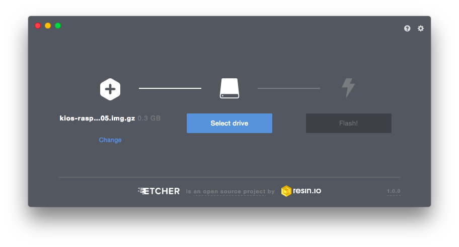
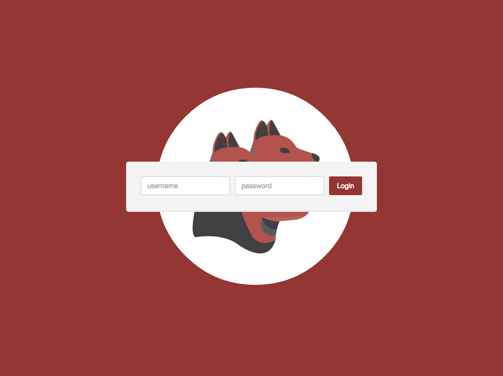

#KiOS

* [Easy Installation](#installer)
* [Advanced Installation](#advanced)
	* [Download the .img](#download)
	* [Flash the .img to a SD card with Etcher.io](#flash)
	* [Network configuration](#network)
* [Power on the Raspberry Pi](#poweron)
* [Access the Raspberry Pi with SSH](#access)

## Introduction

[KiOS](https://github.com/kerberos-io/kios) (Kerberos.io Operating System) is our own **custom linux OS**, which runs Kerberos.io out-of-the-box. KiOS is **installed like every other OS** for the Raspberry Pi, you need to flash the OS (.img) to a SD card. If you want to get Kerberos.io up and running at a short time frame, this is the **most simple** and **basic** installation procedure.

You can install KiOS by using our **own installer**, which gives you a nice GUI that will handle the flashing and network configuration for you, or you can do the flashing **yourself** by using Etcher.

<button id="installer-btn" class="btn" style="width: 49%; height: 50px; background-color: #943633; font-size: 16px; color: #fff; outline: 0;">Easy installation</button>
<button id="advanced-btn" class="btn" style="width: 49%; height: 50px; background-color: #ddd; font-size: 16px; color: #fff; outline: 0;">Advanced installation</button>

	<h2>Easy Installation</h2>

	 
<b>ATTENTION!</b> 
	 We've experiencing <b>issues with the easy installation</b> if you are running <b>Windows 10</b>. When you're also experiencing issues, please follow the advanced installation using the Etcher installer. Meanwhile we'll try to resolve those issues.
	 

	 

        Installing <b>Kerberos.io</b> to your IoT device, has never been so easy. By using our <b>cross-platform</b> installer, you can run a <b>fully configured</b> video surveillance system within <b>3 minutes</b>. Indeed, we also think that's awesome!
    

	

	

        
                        <button type="button" class="btn btn-success btn-lg dropdown-toggle" style="font-size: 18px; width: 10%;"  data-toggle="dropdown" aria-haspopup="true" aria-expanded="false">
                            
                            Toggle Dropdown
                        </button>
                        <ul class="dropdown-menu" style="width:100%; margin: 0; padding:0"></ul>
                    

	
By using the KiOS installer, you'll get <b>an easy to use GUI</b> which allows you to configure and flash KiOS to your SD card. Just download the installer, select a version, specify your network configurations, select your SD card and press the flash button; it can't be easier.

	    

<h2>Advanced Installation</h2>

If you prefer <b>the hard way</b>, you can also flash <b>Kerberos.io</b> to your SD card manually. So it's not a problem if you don't want to use the KiOS installer. It goes as follows: download the KiOS .img yourself, flash it to your SD card with Etcher and edit some configuration files at the boot directory. The big difference with the easy installation, is that you'll need to download the image manually, and edit some files on the SD card to setup your network configuration.

<h2>1. Download the .img</h2>

All releases are stored on the KiOS <a href="https://github.com/kerberos-io/kios"><b>Github repository</b></a>, each release contains several images (for every Raspberry Pi version a different image is created). It's important to download the correct image; installing an image for another Raspberry Pi version will not work. After downloading, make sure to unzip the release.

<h2>2. Flash the .img to a SD card with Etcher.io</h2>

For the advanced installation <b>we'll use Etcher</b>, it will handle the flashing for us. As you may have noticed the installer, used in the <b>Basic installation</b>, is forked from the original Etcher application. The major difference between Etcher and our own installer (fork) is that we've added some configurational sugar on top of Etcher; setup network configuration and automatic downloading of the KiOS release.

So the only thing you'll need to do for flashing, the hard way, is to <b><a target="_blank" href="https://etcher.io">go to Etcher.io</a></b> and download the Etcher installer that matches your OS. After installation you can simply open Etcher and go with the flow: <b>select the KiOS image</b> which you've previously downloaded, <b>select your SD card</b> and <b>click the flash button</b>. Tadaaaa, and you're ready to rumble.

	
	<h2>3. Network configuration</h2>

	
After the image has been transferred, you can plug the SD card in to your Raspberry Pi and everything will work magically. By default the KiOS image will require an ethernet connection and use DHCP to give you a dynamic IP-address. However if you want to have a <b>static IP-address</b> or/and use a <b>wireless connection</b>, you'll need to do a small configuration. Insert the SD card into your working station and open the SD card, you'll see two files <b>static_ip.conf</b> and <b>wireless.conf</b>.

	<h3>Static IP-address</h3>

	
Open and edit the file <b>static_ip.conf</b>.

	<pre><code>#####################################################################
# Enter the IP-address you want to have, followed by the subnet mask
# e.g. 192.168.0.10/24

static_ip=""

#####################################################################
# Enter the Gateway and DNS, this will be your router in most cases
# e.g. 192.168.0.1

static_gw=""
static_dns=""</code></pre>

	<h3>Wireless connection</h3>

	
Open and edit the file <b>wireless.conf</b>. Fill-in your WIFI credentials: <b>SSID</b> the name of your wireles network, and <b>PSK</b> the password of your wireless network.

	<pre><code>update_config=1
ctrl_interface=/var/run/wpa_supplicant

network={
	scan_ssid=1
	ssid=""
	psk=""
}</code></pre>

<h2>Power on the Raspberry Pi</h2>

When the installation is completed, you can <b>plug the SD card</b> into your Raspberry Pi. From this point KiOS will boot the kernel and re-partition your SD-card; Please note that the first time you boot KiOS it can take about 2 mins before the system is operational. When KiOS is ready you can <b>open your favorite browser</b> and type in the IP address of your Raspberry Pi. This will open the Kerberos.io login page, which you can <b>access</b> with the username: <b>root</b> and password: <b>root</b>.

<h2>Access the Raspberry Pi with SSH</h2>

To use Kerberos.io you only need access to the webinterface, however you can also <b>access the system with SSH</b>.

<pre><code>Cedrics-Mac-mini:build cedricverst$ ssh root@192.168.0.12
Welcome to kios-79e30bbb!
[root@kios-79e30bbb ~]# </code></pre>

Note that by default no root password is set, you can define a password in the <b>/data/etc/kios.conf</b> file.

<pre><code>[root@kios-79e30bbb ~]# nano /data/etc/kios.conf
[root@kios-79e30bbb ~]# reboot</code></pre>

Add your password, save the file and reboot the system.

