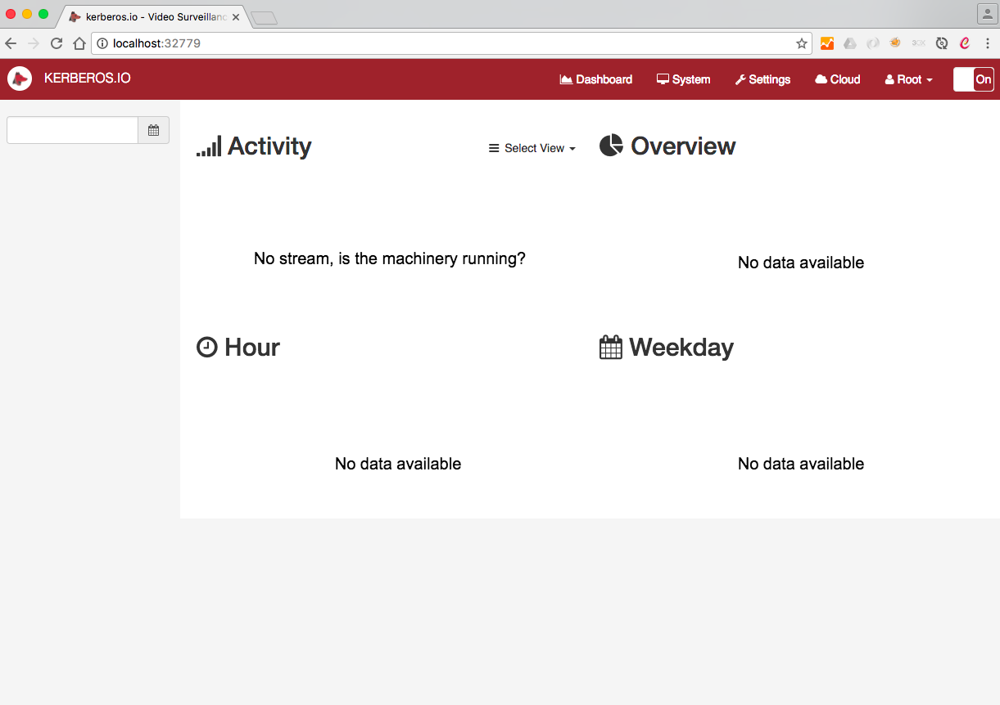

# Multi-camera with Docker

If you own multiple IP-cameras, then you probably **don't want** to setup **a Raspberry Pi for each camera**. Thanks to Docker there is an easier approach: instead of running multiple machines you can run multiple containers on a single machine. And when you're processing a lot of cameras, you can **distribute the cameras/containers across multiple machines** by using **Docker Swarm**.

## This is how it goes..

The approach is equal to [**the traditional Docker approach**](/installation/docker). First you need to make sure you have **Docker installed** on the machine(s) you prefer. After the installation you can use docker-compose to get Kerberos.io up and running. Create a **docker-compose.yml** file and add following configuration:

    machinery:
        image: kerberos/machinery
        ports:
        - "8889"

    web:
        image: kerberos/web
        ports:
        - "80"
        volumes_from:
        - machinery
        links:
        - machinery

Instead of running docker-compose up, we add an additional parameter **-p**. This will create and link the containers from the compose file, but will **wrap and isolate** the containers **in a project**. By reusing this command, and defining different project names, you can run multiple Kerberos.io instances on the same machine (or distribute them over multiple machines). Suppose that we want to start three containers:

    $ docker-compose -p camera-frontdoor up -d
    $ docker-compose -p camera-partyroom up -d
    $ docker-compose -p camera-garden up -d

If you type in the **docker ps** command, you'll get an overview of all the containers that are started; see a stripped output below. In the ports section you'll see the ports that have been exposed to access the web interface of each project.

    $ docker ps

    CONTAINER ID        IMAGE                CREATED             PORTS                            NAMES
    30f74ea52852        kerberos/web         3 seconds ago       443/tcp, 0.0.0.0:32779->80/tcp   cameragarden_web_1
    873d6bae8ea1        kerberos/machinery   5 seconds ago       0.0.0.0:32778->8889/tcp          cameragarden_machinery_1
    439b3f7167fc        kerberos/web         7 seconds ago       443/tcp, 0.0.0.0:32777->80/tcp   camerapartyroom_web_1
    9f8ed40c0d6e        kerberos/machinery   9 seconds ago       0.0.0.0:32776->8889/tcp          camerapartyroom_machinery_1
    dc97a63ffc2d        kerberos/web         22 seconds ago      443/tcp, 0.0.0.0:32775->80/tcp   camerafrontdoor_web_1
    1f3d6735405e        kerberos/machinery   23 seconds ago      0.0.0.0:32774->8889/tcp          camerafrontdoor_machinery_1

If we want to connect to the web interface of the **cameragarden** container, we can open our browser and enter the url **http://your-ip:32779**.

