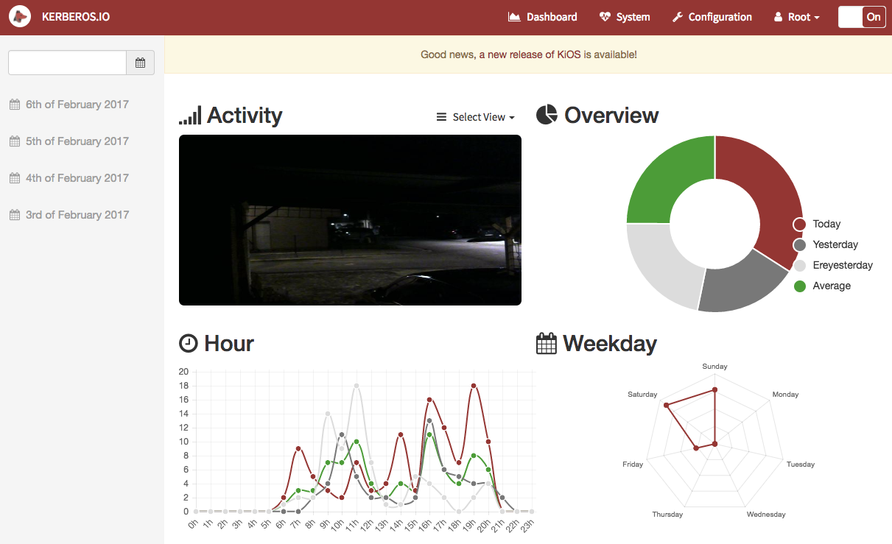
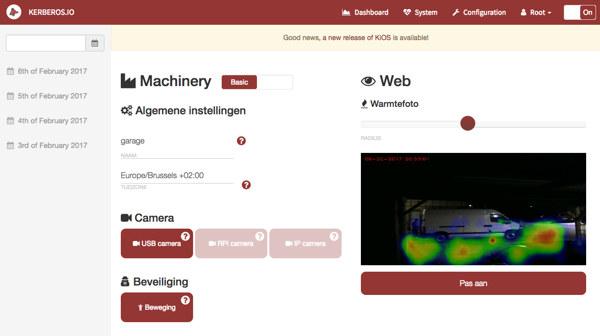
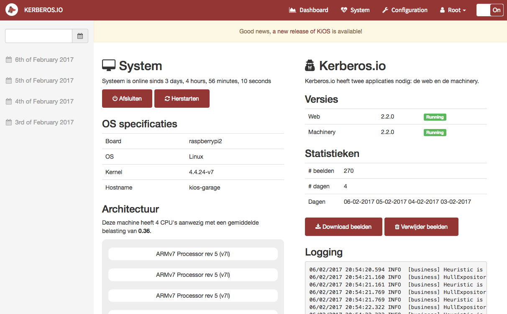
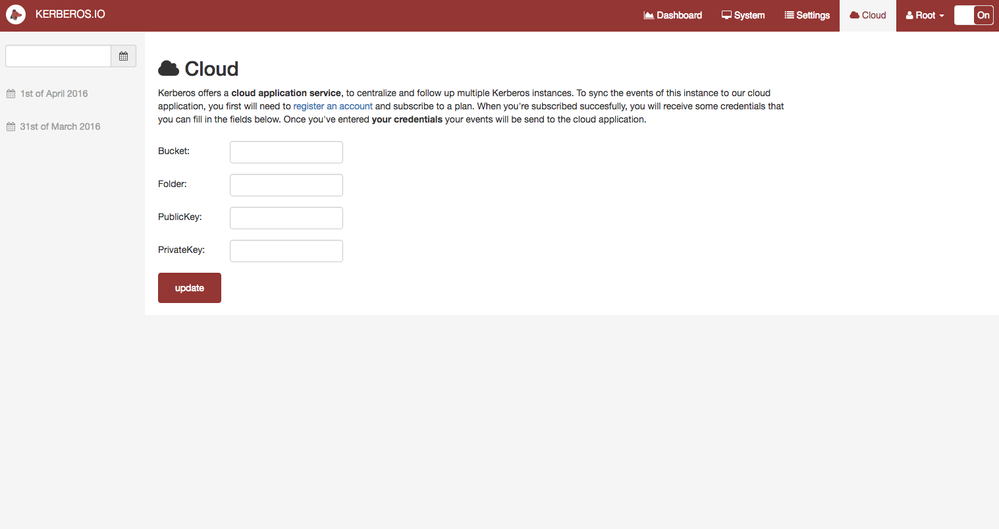

# Introduction

The web is responsible for the visualization. It's a **GUI** which helps the user to find activity at a specific period, configure the machinery, view a live stream, see system information and much more. 

## How does it work?

The web is written in PHP using the extremely popular PHP Framework **Laravel**, and Javascript using the client-side framework **BackboneJS**; to create the dynamic behaviour. We will discuss the different pages and functionality briefly. Please check out the [**demo environment**](https://demo.kerberos.io) if you want to see a real life example.

### Dashboard

The landing page of the web is the dashboard. On the dashboard a user will see some statistics: activity per hour, activity per day, a live stream, the latest activity and a heatmap.

### Overview

When selecting a specific day, you'll will get a timeline and overview. By using the timeline you can navigate through a day; the timeline highlights the amount of activity, from gray to red.

### Settings 

The settings page allows you to configure the machinery. You can define the type of camera, post-processes, conditions and much more; it's **highly configurable**.

### System 

The system page allows you to **monitor** the system. On this page you'll get an overview of the **system specifications** (CPU, Memory, Network, etc). When installed KiOS, you'll also get the possibility to **update Kerberos.io** to a newer release. Several actions are available: you can **download system information** (for debugging purposes) and **download or remove** your images.

### Cloud 

On the cloud page you can configure Kerberos.io to **sync the images** to your cloud subscription. All you need to do is fill in your credentials and you're ready to go.

