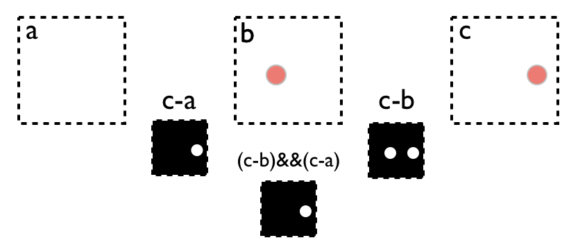

# Differential images

This algorithm is **a very simple method to detect motion**; in terms of *understanding* but also *processing*. Just like the name says, it's the result of comparing images. When the images are compared, we know the pixels that have been changed and if the amount of pixels that changed is big enough, one can say that something happened and thus motion was detected.

To get a more technical explanation: the algoritm will substract 2 or more images, and once that is done it will end up with a black and white image. The white pixels will mark the pixels that where different/changed and the black pixels are the pixels that have not changed; background pixels. Please note that there are several different combinations of substracting images. However for the Kerberos.io project, we will use the method of *Collins et al.* as this method erases the phenomenon "ghosting".

In the image above the method of *Collins et al.* is illustrated. For this method we will process three images. The images are a sequence (from left to right), so the first (A) image was taken before the second (B) one, and the second (B) before the third (C) one. Next we will do a first comparision (C-B) of the third (C) image and the second (B) image, and after that we will do a second comparison (C-A) of the third (C) image and first (A) image. 

After the comparison we will end up with two difference images (C-B) and (C-A); both will mark the white pixels as changed pixels and black as non-changed pixels. To finish the algorithm we will do a logical AND-operation of the two difference images; this will give us the final black and white image ((C-B)&&(C-A)).

The main idea of the Colins et al. method, is that it will erase "ghosting". In the last step we are doing a logical AND-operation, by doing this we will only keep the pixels, that changed in the first two images; therefore we can elimante false positives.

A more detailed explanation can be found [here](http://blog.cedric.ws/opencv-simple-motion-detection).

## Web 

## Parameters

The parameters of the Differential image algorithm can be found in the *config/algorithm.xml* file, but you can also use the web to modify the parameters. Below you see a default configuration file.

	<algorithms>

		<DifferentialCollins>
			<erode type="number">5</erode>
	    	<threshold type="number">20</threshold>
	    </DifferentialCollins>
    
	</algorithms>

### Erode

The erode parameter represents a structural element (a morphological operation), which will be used to minimize the changed pixels; more information about eroding can be found [here](http://docs.opencv.org/doc/tutorials/imgproc/erosion_dilatation/erosion_dilatation.html). The idea of the eroding is that pixels which are isolated will be removed; this means that when only one pixel changed, that pixel will reverted to the non-changed state. But for example when a large change happens and a lot of adjacent pixels are changed, the eroding will not be able to revert them.

The higher the number of the erode parameter, the more aggressive the eroding will be. So high erode values, will make it possible that also large changes will be reverted to the non-changed state.

### Threshold

When doing the comparison of two images, we won't end up with a clean black and white image. In most of the cases the values will be between 0 and 255; so gray values. This means that the value **0** will mean that both pixels where the same in both image, and values **255** mean that both pixels where totally different in both images. Of course we will also have values between 0-255, so pixels that are a little bit different in both images. So to make the resulting black and white image, we will need to apply a threshold value. 

The threshold will specify how much a pixel has to be different in the two images. So for example when the threshold is 30, it means that the difference between two pixels has to be equal or more then 30. The higher the threshold the more the pixel needs to be different, to be marked as changed.