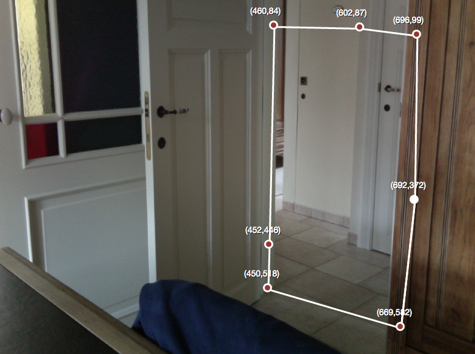

# Hull

This hull is a more complex expositor than the rectangle. A hull can be selected with the web, you can select one or more coordinates to create a flexible region. The coordinates can be adjusted afterwards and be removed by double clicking on the coordinate. You can expand the hull by removing the start coordinate, which is marked by the white bullet.

## Parameters

The parameters of the hull expositor can be found in the **config/expositor.xml** file, but you can also use the web to modify the parameters. Below you see a default configuration file.

	<expositors>
		<Hull>
		    <region type="hullselection">347,361|627,266|975,328|1091,328|1148,413|1158,516|1121,534|962,567|699,648|531,700|243,613|423,550|665,453|850,470|666,361|467,385|325,460|165,372</region>
		</Hull>
	</expositors>

### Region

The region parameter contains n values. Each value represents a coordinate (x,y) and are seperated by the "|" delimiter. These coordinates are used to calculate the concave hull. Pixels of interest that lie within the concave hull are valid pixels; if not they are invalid.
