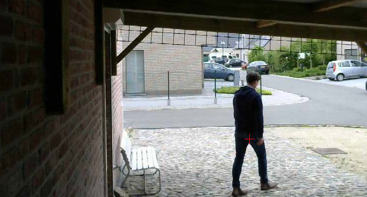
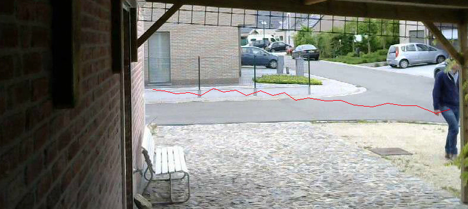

# Counter

Counting objects forms the basis for a range of high-tech solutions, including retail analytics, queue management, building management and security applications. By using the counter heuristic **you can count incoming and outgoing objects** (e.g. people). By defining two lines, the counter heuristics can count the incoming (green line) and outgoing (red line) objects.

The quality of the Counter heuristic depends heavily on the accurancy of the chosen algorithm (Differential, Background subtraction, etc). Therefore **we recommend** to use the **Background Subtraction algorithm** as this is the most accurate one; the algorithm is used for segmentation and it will distinguish background and foreground. 

After the algorithm did its magic, the segmented image is used by the Counter heuristic to calculate some features: the **center of mass** is calculated for each foreground segment, and is stored in memory together with the height and width of the segment. By using the coordinates of the center of mass a trajectory is calculated.

$$ \texttt{mu} \_{ji}= \sum \_{x,y}  \left ( \texttt{array} (x,y)  \cdot (x -  \bar{x} )^j  \cdot (y -  \bar{y} )^i \right ) $$

$$ \bar{x} = \frac{\texttt{m}\_{10}}{\texttt{m}\_{00}} , \; \bar{y} = \frac{\texttt{m}\_{01}}{\texttt{m}\_{00}} $$

While the capture device is taking images, the counter heuristic will calculate the features (as mentioned before) for every subsequent frame. When calculated **the heuristic will search for the best match**: the closest, in terms of distance, center of mass is searched from the previous calculation. When the best match is found the center of mass (with its features) is added to the feature list of the best match; or if not found, a new feature list is created.

The idea of the feature list is that it contains the trajectory of an object which is moving from one point to another (a person walking by). A feature list exists for every moving object in the viewport of the camera and each feature list contains the sequence of center of masses (the x- and y-coordinates of the object).

After the center of masses are calculated, existing feature lists are expanded or new feature lists are created (the start of a new object). By using the feature lists, **the direction of the moving objects** can be calculated, as it contains the initial center of mass and the last found center of mass. 

As we know the trajectory of an object (and thus its direction), the intersection is calculated with the incoming (green line) and outgoing (red line). If the trajectory intersects both incoming and outgoing lines, the direction of the trajectory is used to determine which line was interesected first (and this is an incoming or outgoing object).

## Parameters

The parameters of the Counter heuristic can be found in the **config/heuristic.xml** file, but you can also use the web to modify the parameters. Below you see a default configuration file.
	
	<heuristics>
	    
		<Counter>
		    <appearance type="number">5</appearance>
		    <maxDistance type="number">90</maxDistance>
		    <minArea type="number">1400</minArea>
		    <onlyTrueWhenCounted type="bool">true</onlyTrueWhenCounted>
		    <minimumChanges type="number">20</minimumChanges>
	        <noMotionDelayTime type="number">1000</noMotionDelayTime>
			<markers type="twolines">100,100|100,200|200,100|200,200</markers>
		</Counter>

	</heuristics>

### Appearance

The appearance parameters works as a time-out value. If a feature lists hasn't been updated for x (appearance) times in a row, it's removed. The idea is that when an object has moved outside the viewport of the camera, it can't be tracked anymore.

### Max Distance

While calculating the center of masses, the best match is searched for each one. As the best match is calculated in function of the distance, a maximum distance is used to limit the matching process.

### Min Area

The center of mass is calculated for each segment which has an area which is larger than the minimum area.
e
### Only true when counted

By default the heuristic will only return true when one or more objects are marked as incoming or outgoing. However by unchecking this option you can make the heuristic return true when something changed (same behaviour as the sequence heuristic). The idea is that one wants to track the incoming and outgoing objects, but also want to have images for every change.

### Minimum changes

The heuristic will only procede true if enough changes have been detected.

### No motion delay time

When the heuristic is not valid, the heuristic will idle for some time.

### Markers

The start- and en-coordinates of both the incoming and outgoing lines (delimited by the pipe symbol).

## Output

The whole point of the counter heuristic is counting objects. Therefore when one or more incoming or outgoing objects are detected the results are added to the JSON object which is passed along the four passway. The JSON object can be retrieved by using the [**Webhook IO device**](/machinery/Outputs/webhook).

	[
 		'regionCoordinates' : [618, 317, 703, 493],
  		'numberOfChanges' : 5446,
  		'incoming' : 0,
  		'outgoing' : 1,
  		'timestamp' : '1465894497',
  		'microseconds' : '5-97451',
  		'token' : 695,
  		'pathToImage' : '1465894497_5-97451_frontdoor_618-317-703-493_5446_695.jpg',
  		'instanceName' : 'frontdoor',
	]