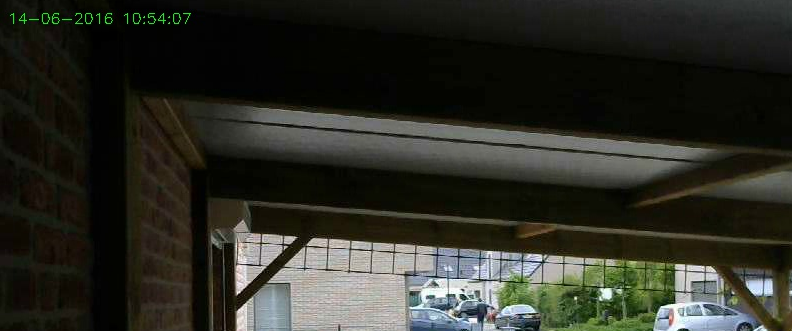
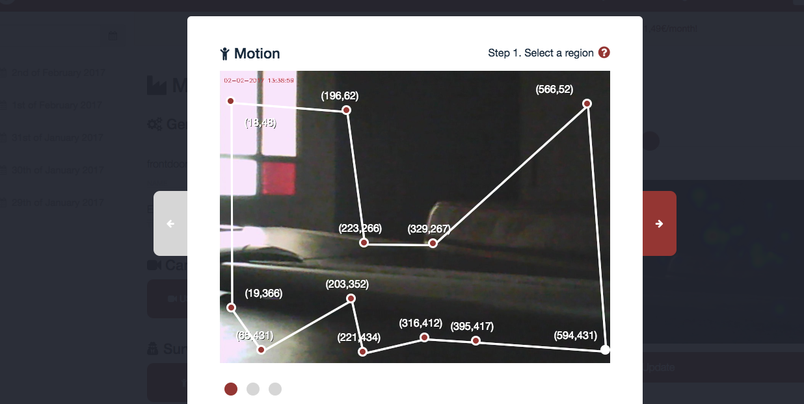
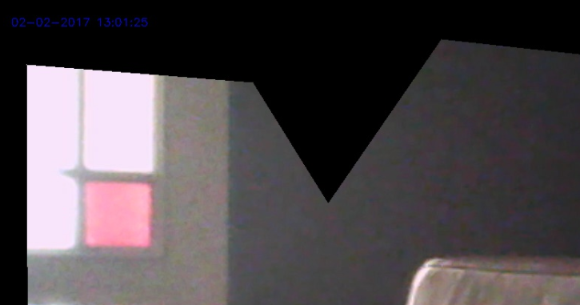

# Disk

An image can be saved to disk.

## Parameters

The parameters of the Disk output device can be found in the **config/io**.xml file, but you can also use the web to modify the parameters. Below you see a default configuration file.

	<ios>
	    <Disk>        
	    	<fileFormat type="text">timestamp_microseconds_instanceName_regionCoordinates_numberOfChanges_token.jpg</fileFormat>
    		<directory type="text">/etc/opt/kerberosio/capture/</directory>
        	<markWithTimestamp type="bool">false</markWithTimestamp>
        	<timestampColor type="text">white</timestampColor>
	        <privacy type="bool">false</privacy>
    	</Disk>    
	</ios>

### File format

The format that will be used for the name of the image. One or more variables can be defined and will be replaced by the machinery. Note that when you're using a variables name in the file format, that this name should be defined in the JSON object.

### Directory

The directory where the image will be saved to. By default images are saved to the **/etc/opt/kerberosio/capture** directory.

### Mark with timestamp

When this settings is set to **true**, the image is marked with a timestamp .

### Timestamp color

A color can be defined for timestamp: white, black, red, green and blue.

### Privacy

The privacy mode can be activated to remove some parts from the image. This especially helpful if you want to filter out public areas.

After updating the configuration, you'll see that the pixels outside your region of interest (ROI) are made black; the image below illustrates this.

