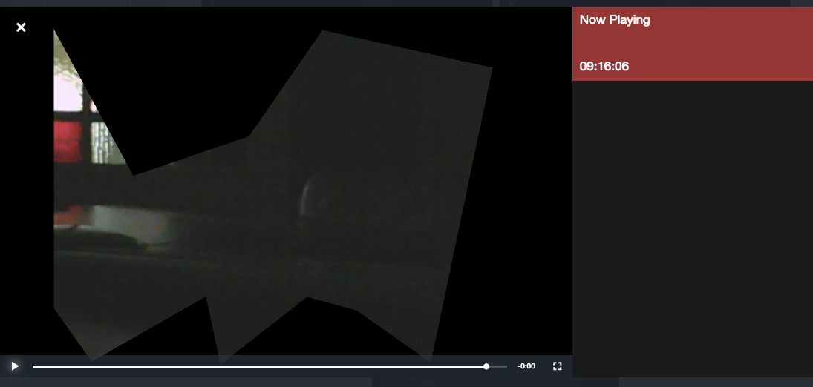

# Video

When a valid event is detected, a video will be recorded for x seconds. When more valid events are detected, while a video is recording, the video file will further record for x seconds; so no new video file be recorded, but the existing one will be expanded.

## Parameters

The parameters of the Video output device can be found in the **config/io**.xml file, but you can also use the web to modify the parameters. Below you see a default configuration file.

	<ios>
		<Video>
			<fps type="number">3</fps>
			<recordAfter type="number">5</recordAfter>
			<maxDuration type="number">120</maxDuration>
			<extension type="number">mp4</extension>
			<codec type="number">h264</codec>
			<fileFormat type="text">timestamp_microseconds_instanceName_regionCoordinates_numberOfChanges_token</fileFormat>
			<directory type="text">/etc/opt/kerberosio/capture/</directory>
			<hardwareDirectory type="text">/etc/opt/kerberosio/h264/</hardwareDirectory>
			<enableHardwareEncoding type="bool">true</enableHardwareEncoding>
			<markWithTimestamp type="bool">false</markWithTimestamp>
			<timestampColor type="text">white</timestampColor>
			<privacy type="bool">false</privacy>
			<throttler type="number">0</throttler>
		</Video>
	</ios>

### FPS

The frames per second of the video being recorded. Please note that this number is limited and depends heavily on your hardware setup. You'll be receiving following warning in the systems logs, if Kerberos.io can't write the desired FPS.

	[trivial] IoVideo: framerate is too fast, can't record video at this speed (8/FPS)

### Record after

The number of seconds recorded after the last valid event was detected. This means that when a video is already recording, and a valid event was detected, the video will be expanded with x more seconds.

### Extensions

The extension or container of the video file. We highly **recommend to use the MP4 container** if you want cross-browser support. Leave this setting by default, if you don't know what you're doing.

### Codec

The codec that is used to encode the video file.

### File format

The format that will be used for the name of the image. One or more variables can be defined and will be replaced by the machinery. Note that when you're using a variables name in the file format, that this name should be defined in the JSON object.

### Directory

The directory where the videos will be saved. By default videos are saved to the **/etc/opt/kerberosio/capture** directory.

### Hardware directory

When using onboard hardware encoding (e.g. with Raspberry Pi camera), **h264 video files are generated** and stored in this directory. **Afterwards** these h264 files will be **containerized to mp4 files**, and stored in the Directory path.

### Enable Hardware encoding

A boolean which can enable or disable hardware encoding. Please note that this option is enabled by default, but does not mean that it will work if you choose to use an USB camera.

### Mark with timestamp

When this settings is set to **true**, the video is marked with a timestamp (similar to the Disk device).

### Timestamp color

A color can be defined for timestamp: white, black, red, green and blue.

### Privacy

The privacy mode can be activated to remove some parts from the video. This especially helpful if you want to filter out public areas.

After updating the configuration, you'll see that the pixels outside your region of interest (ROI) are made black; the image below illustrates this.

### Throttler

Control the number of executions by setting a throttling value. E.g. if you set throttling to 5, the Video will only be triggered once in 5 seconds, nevertheless more detections occurred.
