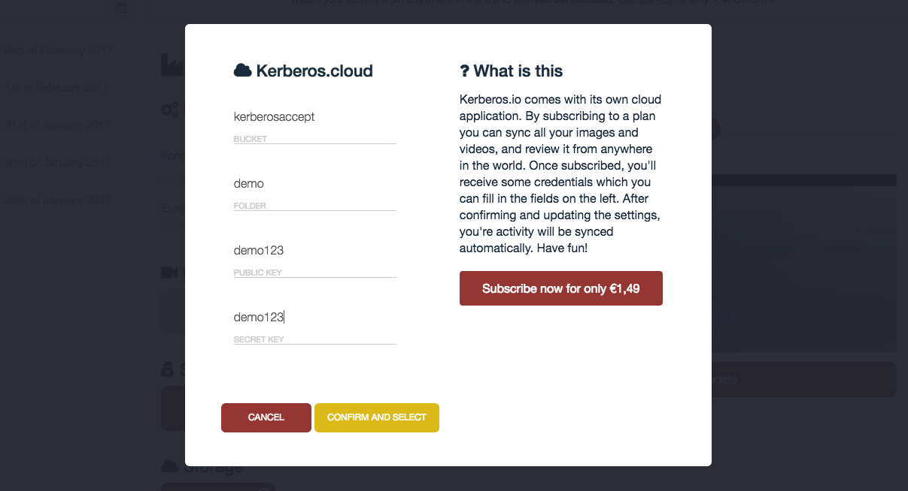
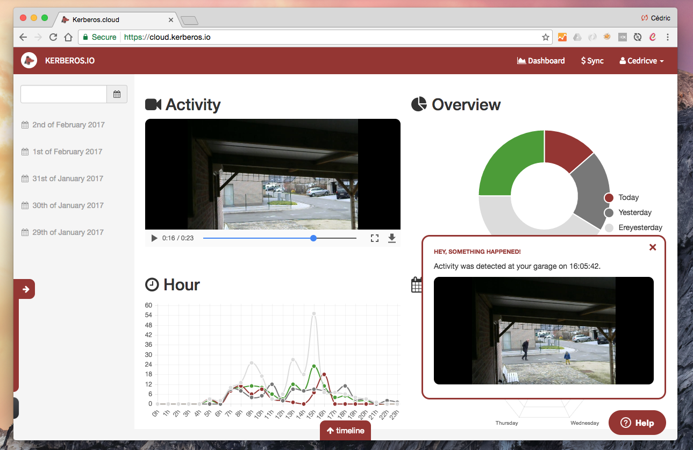

# Cloud

Once Kerberos.io is installed on the Raspberry Pi, the machinery and webinterface are available. A user can browse to the IP address (e.g. http://192.168.0.13) of the Raspberry Pi to configure the machinery and view the events that were taken by the machinery. However to be able to browse to the Raspberry Pi, **a user has to be in the same internal network** as where the Raspberry Pi is located; otherwise the webpage wouldn't be accessible. To make the Raspberry Pi accessible for the public, you will need to do some **additional configurations on your router**.

Another solution would be to use [**the cloud service**](https://cloud.kerberos.io) that Kerberos.io is offering; A user pays a monthly fee to use the Kerberos.io cloud service. You can attach multiple Kerberos.io instances to the cloud service with only one license.

## Video

In the video below you get a brief overview of the different features.

<iframe src="https://player.vimeo.com/video/121532472?autoplay=0&color=943633#t=13m32s" style="width:100%; height: 400px;" frameborder="0" webkitallowfullscreen mozallowfullscreen allowfullscreen></iframe>

## How does it works?

When subscribed to Kerberos.cloud succesfully, you'll receive some credentials which you can enter in to your Kerberos.io installation. From then all the **images** or **videos** you capture are synced to the Kerberos.cloud service.

When opening Kerberos.cloud you'll see your events appear and receive **in-browser notifications**, and if configured Pushbullet notifications on your other devices.

## Where is my data hosted?

We don't own powerful machines to host and protect your data by ourselves, therefore we use services of Amazon Web Services (AWS). For the paranoids this means that your data is in the **cloud**. However we protect your data by the maximum: we **encrypt/decrypt** your data, and **sign** it for a specific amount of time when requested. This means that links are only accessible for x amount of seconds/minutes.

If you feel the need to store the data in your own environment, get in touch with us. We have services to support you.