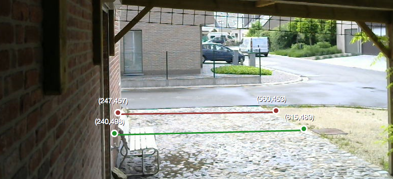
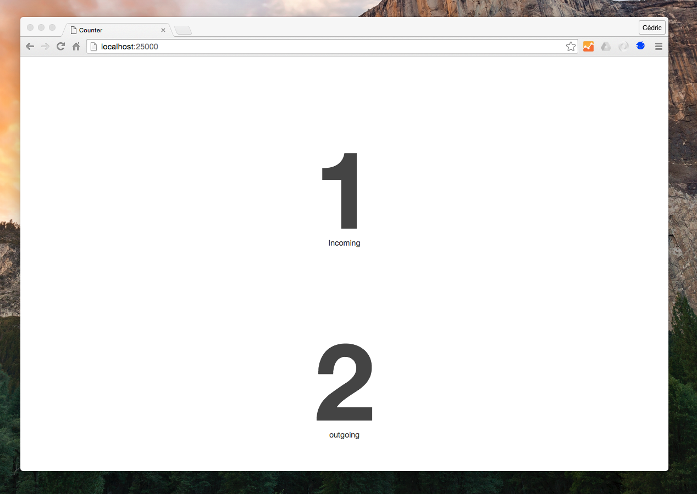
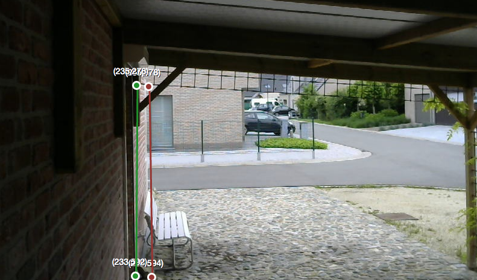
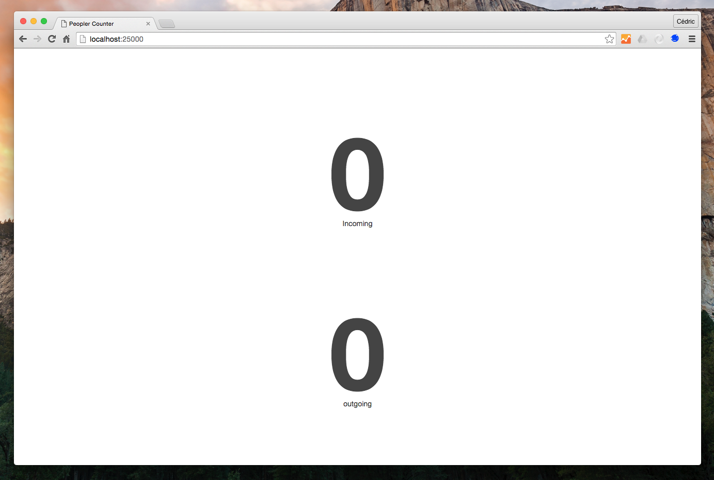

# People Counting

Kerberos.io can be used as a people counter by selecting the [**Counter heuristic**](/machinery/heuristics/counter). The idea is that two lines are drawn: the incoming and the outgoing line. Those two lines are necessary to know if the object is incoming or outgoing. 

If one ore more objects crossed both lines, the number of the incoming and outgoing objects are written to a JSON object (for more information see the [**Counter heuristic**](/machinery/heuristics/counter)). By using the [**Webhook IO device**](/machinery/Outputs/webhook) it's possible to fetch the JSON object and visualize it in your browser.

In this tutorial we'll show you how to configure **Kerberos.io**, so that it can be **used as a People counter**, and build a real-time counter which shows the number of incoming and outgoing objects (see screenshot above).

## Let's get started

To get started, make sure you have properly [**installed Kerberos.io**](/installation/KiOS) on your device. After the installation go to the settings page and change the settings to following configuration:

* Algorithm: Background Subtraction,
* Heuristic: Counter and
* Io: Disk and Webhook.

### Customize parameters

To work properly on a Raspberry Pi we need to tweak the **Capture** device, the **Background Subtraction** algorithm and the **Counter** heuristic a bit.

* Capture device: **minimize** delay times. To count properly we need to process as much images we can, therefore we need to make sure the **delay time** of the **capture device** is **set to 0**.
* Background Subtraction: **set** the **shadow** parameter to false. This is required because it consumes too much CPU, especially when running on a Raspberry Pi Zero.
* Counter: decrease the minArea parameter to 50, and experiment with it (increase it little by little). Finding the ideal minArea is done by trial and error, as it depends on your environment, distance of the camera, etc. 

[**Read this post**](https://kerberosio.zendesk.com/hc/en-us/articles/213586849-People-counter-not-working) for more details.

### Specific the incoming and outgoing lines

When opening the counter heuristic, you'll see two lines (a green and red one) which you can move to the position you prefer. Important to note is that the green line is used for counting incoming objects and the red line for outgoing objects. E.g. if we want to count the people which are entering your home, you should arrange the lines as follows.

### Specify the webhook url

The **Webhook Io device** is used to send the number of incoming and outgoing objects to your own application; therefore we need to specify an endpoint to which the webhook will post the JSON object (e.g. your own API). We will demonstrate how this works with a traditional NodeJS application, which we will create in next paragraph. The application will run on our local machine, and listen on port 25000, therefore we need to change the url of the webhook to: 

	http://localhost:25000

Please note that if the NodeJS application runs on another machine than on which Kerberos.io is running, you should replace localhost by the ip-address of that remote machine. 

### GUI

We will create a simple **nodejs** application using **socket.io** which will listen on port 25000 for **POST** events. When the application receives a **POST** event, it will dynamically increase the incoming and/or outgoing counters. To get started we will clone following repository:

	git clone https://github.com/cedricve/kerberosio-people-counter
	cd kerberosio-people-counter

After the repository is cloned succesfully we will download the necessary packages using **npm**.

	npm install

Run the app with following command

	node server.js

Following output will be generated:

	info  - socket.io started
	Server running on port 25000

Open your browser and browse to **http://localhost:25000** (or the IP-address of the remote machine on which the application is running).

