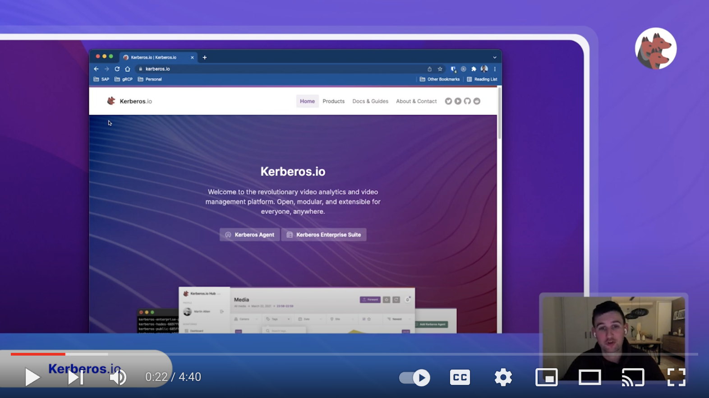

The **Kerberos.io** project, pronounced as `/kuh buh ruhs dot ai o/`, is a video analytics and video management platform, which was initiated back in 2014. Over the years it has evolved into a stable and feature-rich video platform, which is used for video management and analytics such as machine learning.

Next to being stable and feature-rich, Kerberos.io's main differentiator is scale. It helps you moving from a small home deployment to a large scale enterprise deployment. To illustrate the art of the possible, we recommend to have a look [at the deployments page](/prologue/deployments/) to find out the most suitable architecture for your use case.

## The name: Kerberos.io

Many people are confused, and don't understand why this project is called Kerberos.io. If you've been in the IT world for a while you will notice that Kerberos is already used for the authentication protocol [Kerberos](<https://en.wikipedia.org/wiki/Kerberos_(protocol)>).

After all those years, we still believe that the name Kerberos.io makes sense for this project. With a strong emphasize on the suffix **.IO**, which stands for any **(I) input** of camera, and any **(O) output** such as a webhook, bash script, mqtt, etc. Kerberos itself is keeping an eye, using the configured input, and triggers the required outputs.

## What is Kerberos.io

[Kerberos.io](/prologue/how/) is a video analytics and monitoring platform for everyone, from a traditional user to a multinational corporation, we have different solutions and components to help you grow.

Within the portfolio of [Kerberos.io](/prologue/how/) you leverage more or less components depending on the stage you are in, there is no need to overcomplicate things.



The backbone of the Kerberos.io ecosystem is the [Kerberos Agent](/agent/first-things-first/). This [Kerberos Agent](/agent/first-things-first/), installed [through various possibilities](https://github.com/kerberos-io/agent#how-to-run-and-deploy-a-kerberos-agent), is deployed to a compute - VM, baremetal, Kubernetes cluster or other - of choice and connected to a camera stream you control.



With [Kerberos.io](/prologue/how/) you start small, with just one or more [Kerberos Agents](/agent/first-things-first/), and grow over time while introducing more and more components like [Kerberos Factory](/factory/first-things-first/), [Kerberos Vault](/vault/first-things-first/) and [Kerberos Hub](/hub/first-things-first/); which we refer to as the [Kerberos Enterprise Suite](/enterprise/first-things-first/). Each solution is shipped through the concept of containers and can be leveraged by using Docker, Docker compose, Kubernetes, OpenShift, Terraform, Ansible, and many more.



As previously mentioned, the [Kerberos Enterprise Suite](/enterprise/first-things-first) brings additional components into the picture which help you build a more scalable and resilient video landscape through concepts such as Kubernetes, bring you own storage, bring your own cloud, single-pane of glass, live streaming, machine learning, etc.

## Why Kerberos.io

Kerberos.io initiated as a side project, due to inspiration and motivation in the space of video analytics, computer vision and machine learning. Its first focus was video surveillance only, as nowadays burglary and attacks are very common in this world.

Over time we have grown an amazing commmunity, collaborated with lots of international companies and received a lot of kudos for the work we've done. To consolidate our efforts, [we have written down our mission statement](/prologue/mission/), which explains why this projects exists.

## Integration and extension

The majority of video management platforms out there are owned by multinational manufacturers that are building closed systems which are unaccessible in any programmatical way; such as an API. This forces anyone to create unsupported workarounds, which become outdated very quickly.

The whole idea behind Kerberos.io is to challenge previous statement.

> We want open and integratable systems for anyone and anywhere. You generate the data, you own the data.

The response of Kerberos.io is, that any solution you'll find in our portfolio allows you to integrate and extend by default, no workaround, the data belongs to you. We expose Swagger APIs by default, to extract all the data you desire.

You decide where (cloud, self-hosted) and how (Docker, Kubernetes, OpenShift, Terraform, etc) to deploy our solutions, what storage you prefer (local SSE, S3, etc) and how to integrate it with other third-party solutions (Kafka, SQS, etc).

## Machine learning

Machine learning and Artificial Intelligence is a critical component of the Kerberos.io ecosystem. Within Kerberos Vault you can integrate your own machine learning models, and run them at scale. [Learn more about how we support](/vault/machine-learning/) machine learning use cases.
