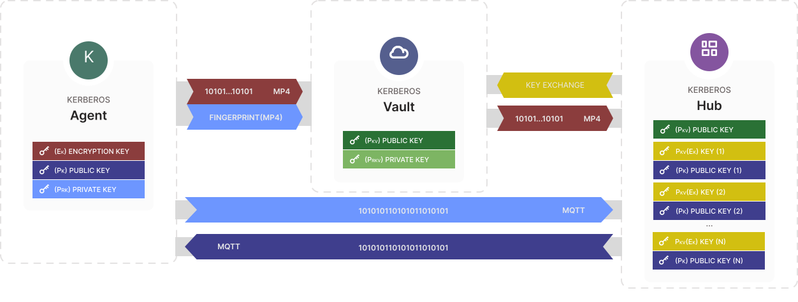
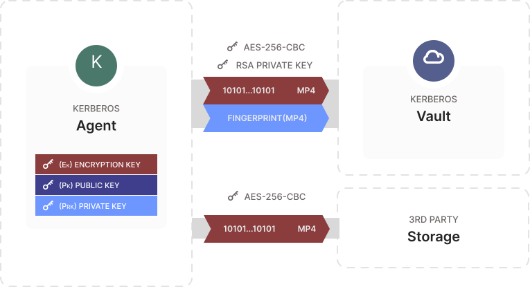
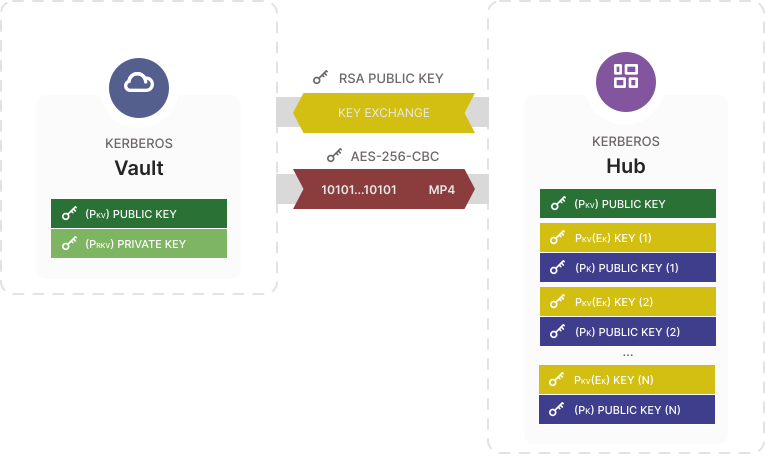
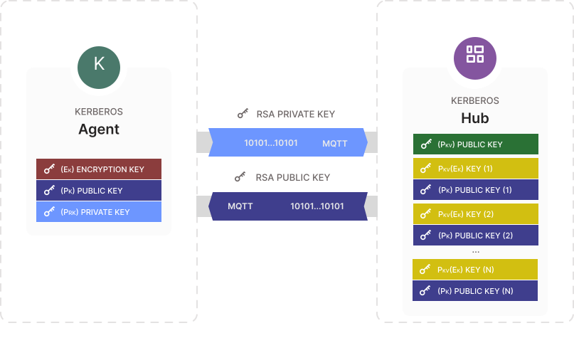

Kerberos Agent main goal is to make recordings and store them somewhere so you can access them. Next to "just" storing them, storing them securely is even more important, due to these we have integrated different levels of security in the Kerberos.io stack.

## Encryption from Kerberos Agent to Kerberos Vault

## Decryption from Kerberos Vault to Kerberos Hub

## Encryption from Kerberos Agent to Kerberos Hub

