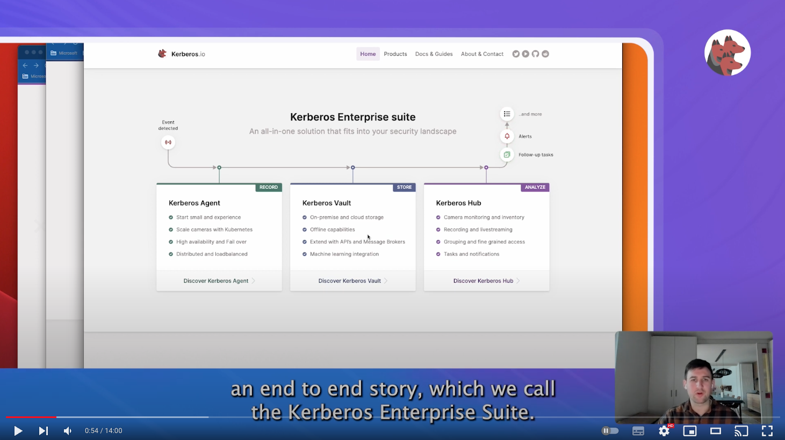

Kerberos Enterprise Suite is a consequence of supporting enterprises and customers for more than 7 years in the video analytics and video streaming industry. Kerberos Enterprise Suite is a collection of best practices supporting the ever-growing needs of enterprises rolling out huge amounts of video streams, requiring extreme flexibility in terms of deployment and customization, and putting strong focus on video analytics and more specific machine learning and AI.

As a result to the developments of the Kerberos Agent, previously called Kerberos Open Source, the Kerberos Enterprise Suite is here to enable more flexibility through concepts such as Bring Your Own Cloud, Bring Your Own Storage and Bring Your Own Technology.

Kerberos Enterprise Suite is taking the Kerberos Agent to another level, by building additional tools on top such as [Kerberos Vault](/vault/first-things-first) and [Kerberos Hub](/vault/first-things-first). It scales your Kerberos Agents through the concept of [Kerberos Factory](/factory/first-things-first) which helps to deploy your Kerberos Agents in bulk.

## Kubernetes: flexible and scale

Kubernetes is a proven, and a widely spread technology which is gaining more momentum every single day. Although many enterprises still have to adopt and embrace Kubernetes, many already do. It's just a matter of time.



Kubernetes sits at the center of the Kerberos Enterprise Suite. Every solution within the suite is build on top of Kubernetes, so it allows you to bring your own cloud, bring your own storage and bring your own technology.

### Bring your own cloud

By using Kubernetes as a basis for [Kerberos Factory](/factory/first-things-first), [Kerberos Vault](/vault/first-things-first) and [Kerberos Hub](/vault/first-things-first), all solutions can be deployed where your Kubernetes cluster can be deployed. This means you can deploy at the edge, in a private or public cloud. As the solutions are modular build, you can also have hybrid deployments. For example processing at the edge and visualisation in a cloud environment, or storage at the edge and limited storage in a cloud environment.

### Bring your own storage

One thing you don't want, is to store your most precious data on someone else storage. We believe you should be the one and only owner of your data, and therefore we have build [Kerberos Vault](/vault/first-things-first), in such a way that you bring you own storage. Bringing your own storage is great, but actually you want to bring multiple storage providers, for example edge storage and cloud storage. The concept of keeping a vast amount of storage at the edge, and [forward only the most important data](/vault/forwarding/) to a cloud environment, is a core feature of [Kerberos Vault](/vault/first-things-first).

### Bring your own technology

Kubernetes brings a lot of advantages in terms of deployment, scalability, resilience, and also high availability, but there is more. Due to the nature of Kubernetes, enterprises and administrators can bring any tool, service, solution or application inside their cluster. As the Kubernetes Enterprise Suite has specific dependencies, there is no need to install already existing tools, but you can reuse the ones you already have.

Next to that, all solutions within the Kerberos Enterprise Suite ships Swagger APIs by default. This allows you to extend or integrate your own solutions or extend them with the technology you already master or prefer within your organisation.

## The solution stack

The Kerberos Enterprise Suite is a collection of modular solutions that can be deployed wherever you want. It contains three crucial parts.

- Kerberos Agents and Kerberos Factory
- Kerberos Vault
- Kerberos Hub

### Kerberos Agents and Kerberos Factory

An agent is deployed for each video stream. An agent is responsible for a specific video stream: recording, livestreaming and alerting. Kerberos Factory is used to scale and deploy the Kerberos Agents in your Kubernetes clusters by providing a UI.



### Kerberos Vault

Kerberos Agents are persisting their recordings at a central place, which we call Kerberos Vault. Within Kerberos Vault you set up multiple edge or cloud storage providers, to persist your data at the edge or in the cloud.



Events and messages [are sent through integrations](/vault/integrations/) to initiate custom processes and applications; for example [a machine learning model](/vault/machine-learning/). Edge and cloud storage are combined and can be enabled in forwarding mode, so only a subset of recordings is persisted in cloud storage.



### Kerberos Hub

[Kerberos Hub](/vault/first-things-first) is a scale UI that consolidates the entire Kerberos ecosystem. It shows livestreams/alerts from your Kerberos Agents and recordings stored in Kerberos Vault through a single pane of glass.

[Kerberos Hub](/vault/first-things-first) is build out of modular and scalable microservices which you can install and scale independently, wherever you want.


