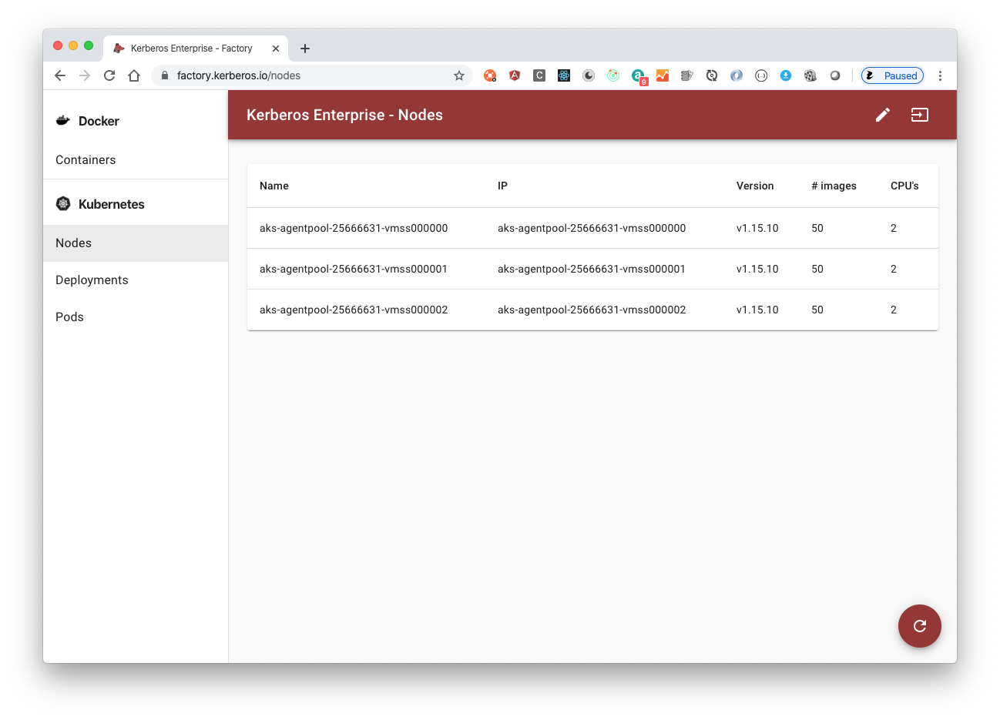

Once you've installed Kerberos Enterprise, you will have the Kerberos Enterprise Factory webapp running inside your cluster. This web application allows you to administrate your Kerberos Enterprise agents as deployments/pods. It comes a bunch of other features as well, read on.

Important to note is that this web app is relying on the Golang Kubernetes SDK, so that means from an administration point of view, you could simply use the well known `kubectl` command. The webapp just add (a lot of) functionalities on top of the Kubernetes API, which are specific to Kerberos Enterprise agents.

 

<iframe src="https://player.vimeo.com/video/405039357" width="640" height="400" frameborder="0" allow="autoplay; fullscreen" allowfullscreen></iframe>

  

## Login page

Once you open a browser, and navigate to the Factory web application (see installation for the url), you will land on the login page.

The default username password of the Factory web applications is:

- username: **root**
- password: **kerberos**

> The username and password [can be changed in the `deployment.yaml` file](https://github.com/kerberos-io/enterprise/blob/master/yaml/factory/deployment.yaml#L54).

## Overview

On the overview page you will find an intuitive overview of the different pages and functionalities. On the left menu you will see two sections: **Docker** and **Kubernetes**. Kerberos Enterprise can both run in Docker (single-host) and Kubernetes (cluster) mode, however the recommended way is of course Kubernetes.

When working with Kubernetes, Kerberos Enterprise agents are deployed as a deployment. When working with Docker, Kerberos Enterprise agents are deployed as traditional Docker containers.

## Kubernetes

On the left menu you will find the Kubernetes section. In this section 3 sub menu's are available:

- Nodes: a list of all the nodes in your cluster.
- Deployments: a list of all the Kerberos Enterprise agents running in your cluster.
- Pods: all the pods running in your cluster.

## Nodes

The nodes section lists all the available nodes inside your Kubernetes cluster. It shows a limited amount of information such as the version, the number of Docker images installed on the node, and some basic hardware information.

## Deployments

The deployments section will list all the Kerberos Enterprise agents (running as deployments) that you have deployed inside your cluster. This page gives you access to deploy new Kerberos Enterprise agents one by one or in bulk. Next to that you can easily upgrade Kerberos Enterprise agents to a newer version, reboot them, view logging and update the configuration options of the Kerberos Enterprise agent.

### Adding a new deployment

There are two options to add a new deployment, single deployments and bulk deployment.

- single deployment

By specifying a name for your deployment and it's corresponding RTSP url, a new deployment will be created for you, and deployed to one of your installed nodes.

- in bulk deployment.

By importing an Excel file, deployments can be created in bulk.

By specifying the name and corresponding RTSP url in multiple rows, you can deploy your deployments in bulk.

### Configuring a deployment

Once you have a running deployment, you should see a green circle next to the deployment, indicating that it is succesfully running. At any time you can configure your deployments by clicking on the <SettingsIcon className="pointer"/> icon. This will open a popup, allowing you to change some settings.

Following settings can be changed:

- One or more regions of interest,
- Time based conditions,
- Pre- and postrecording
- Continious recording
- Linking to [Kerberos Cloud](/cloud) or [Kerberos Storage](/storage/introduction)

### Global configuration

Configuration can be specified on a Kerberos Enterprise agent level, this means that you update the configuration of a specific deployment. However can also be specified at a higher level. This higher level is what we call the global configuration.

By specifying configurations at a higher level, any Kerberos Enterprise agents will inherit from that configuration, improving the overall maintenance and management of your Kerberos Enterprise agents.

### Upgrade or reboot a Kerberos Enterprise agent

At Kerberos.io we have fast development cycles, which means that new versions will be released every day, week or month. To make sure you can upgrade or downgrade your Kerberos Enterprise agent easily, an upgrade feature is built-in. When pressing the upgrade button, you will be able to select the version to which you would like to upgrade or downgrade. Once submitted, **a zero downtime upgrade will take place**. Kubernetes will download the new release, create a new pod, and destroy the old one.

At any moment you can reboot your Kerberos Enterprise agent. When pressing the reboot button, next to your deployment, Kubernetes will destroy the pod of your deployment, and schedule a new one. This comes in handy, when you noticed one of your Kerberos Enterprise agents is in a stale state.

## Pods

When creating a Kerberos Enterprise agent, Kubernetes will create a deployment and schedule a pod. This pod will be  managed by your deployment, and deployed as a Docker container to one of your available nodes. Once a pod dies/ crashes, or whatever unexpected scenario, the deployment will make sure it is deployed again to a different (or the same) node. This makes sure the Kerberos Enterprise agent is in a healthy state at all times.

## Storage and video management

Kerberos Enterprise allows you to scale your video landscape horizontally, using the concept of Kubernetes, and brings a strong backbone for stability and performance. It allows you to avoid reinventing the wheel, and get stuck in the numerious challenges of making an intelligent VMS yourself (we worked on this for 2 years with experienced engineers).

Kerberos Enterprise stores its recordings locally for a short amount of time. This means that long-term storage is not included in the solution. On top of that it also **does not** have a visual component, which allows you te review dashboards or recordings. To overcome these two challenges, long-term storage with extensibility/integration capabilities and visualisation features, following solutions were developed [Kerberos Storage](/storage/introduction) and [Kerberos Cloud](/cloud).

### Kerberos Storage

[Kerberos Storage](/storage/introduction) is a solution which makes it able to store recordings from Kerberos Enterprise agents (accross different clusters) at a central place, on the storage provider you want. You can store your recordings in the cloud (AWS S3, Google Cloud Storage, Azure Blob storage) or on premise (Minio).

On the other hand it's an open platform, as it allows you build extensions and integrations (web apps, mobile apps, machine learning services much more). Kerberos Storage ships with the ability of real-time messaging (Kafka) and a REST API (documented as Swaggger).

To connect one or more Kerberos Enterprise agents to your Kerberos Storage instance, you should open the configuration option and navigate to the `cloud` tab. Once selected you need to fill-in the credentials from your Kerberos Storage account.

- Storage URI: this is the API endpoint of your Kerberos Storage instance. Typically this is in the following format: `http(s)://api.yourdomain.com/storage`. Where `api.yourdomain.com` should match your Kerberos Storage API endpoint.

- Provider: the name of the provider, which you created on the Kerberos Storage providers page, to which you want to send your recordings to.

- Directory: this is the subdirectory in which your files will be stored. At the time of writing this should also equal your Kerberos Cloud username, if you plan to upload to Kerberos Cloud.

- Access Key: this should match the access key of one of your Kerberos Storage accounts.

- Secret Access Key: this should match the secret access key of one of your Kerberos Storage accounts.

### Kerberos Cloud

For the visualisation part Kerberos Cloud comes into the picture. Kerberos Cloud is a web app, backed up with a number of microservices, that shows dashboards, live streams, filter recordings and much more. Learn more [about the features and functions here](/cloud).

You have two choices when using Kerberos Cloud, either you send your recordings from your Kerberos Enterprise agents directly to Kerberos Cloud, or you send your recordings to Kerberos Storage, and connect Kerberos Storage to Kerberos Cloud. About the latter more is explained on the [Kerberos Storage page](/storage/get-started).

Select the Kerberos Cloud option, and copy-paste the credentials from your Kerberos Cloud subscription.

- Region: this is the region where your recordings will be stored. Only `eu-west-1` for now (will change, on the roadmap).

- Bucket: the name of the Kerberos Cloud bucket.  Only `kerberosaccept` for now (will change, on the roadmap).

- Directory: this is your personal directory, and matches your Kerberos Cloud username.

- Public Key: this should match the public key of your Kerberos Cloud subscription.

- Secret Access Key: this should match the private key of your Kerberos Cloud subscription.