Welcome to our family! This page will explain and showcase how to connect and configure the Kerberos Enterprise Suite. We will go through some configuration steps, so your data will flow from your Kerberos Factory and Kerberos Agents to Kerberos Vault to Kerberos Hub. What are we waiting for, let's go.

## Prerequisites

This section expects you have a working setup with all components installed; Kerberos Factory, Kerberos Vault and Kerberos Hub.

Typically you will host Kerberos Factory (including the Kerberos Agents) and Kerberos Vault on your side and leverage the Kerberos Hub SAAS environment. However nothing stops you in hosting all yourself, or only be in charge of the Kerberos Factory and let us handle Kerberos Vault and Kerberos Hub in a private installation.

## The Architecture

Everything starts at your Kerberos Agent. The agents are connected to camera streams (RTSP) and depending on the configuration they might record videos and store them locally on their local disk.

To get those recordings in a central storage like S3, Storj, Ceph, Minio or any other compatible S3 storage we will leverage the Kerberos Vault solution.

Once recordings are entering in the underlaying central storage an event is send to Kerberos Hub through a message broker like SQS or Kafka. The event is parsed and passed-through different microservices. Each microservice will perform a specific action on the recording varying from generating metadata to machine learning and computer vision.

Once done navigating through the different microservices the recording will become available in Kerberos Hub. Within Kerberos Hub you will able to view livestreams from your Kerberos Agents, create alerts and more.

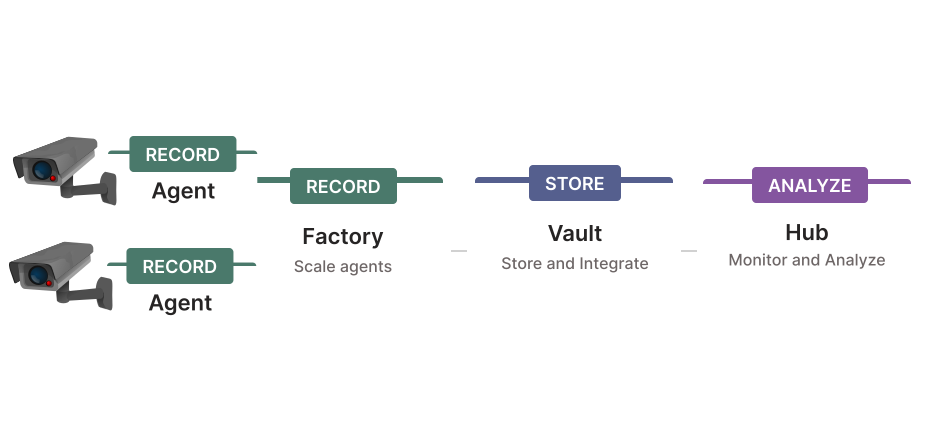

## Kerberos Hub

Ok let's start! Before we can continue we will need to gather some information, which we will use in the next sections to configure and setup the different solutions and integrations properly.

Once you have your Kerberos Hub installed, or you have purchased a subscription on our Kerberos Hub SAAS, you will need following information: 

- Username
- Public access key
- Private key (only with a subscription on Kerberos SAAS)
- Kerberos Hub API url (you retrieve this by opening the Swagger API docs in the left navigation)
    
You will find those details on the `Plans & Integrations` page of your Kerberos Hub installation. Use your username and password to sign into Kerberos Hub and navigate to the `Plans & Integrations` page.

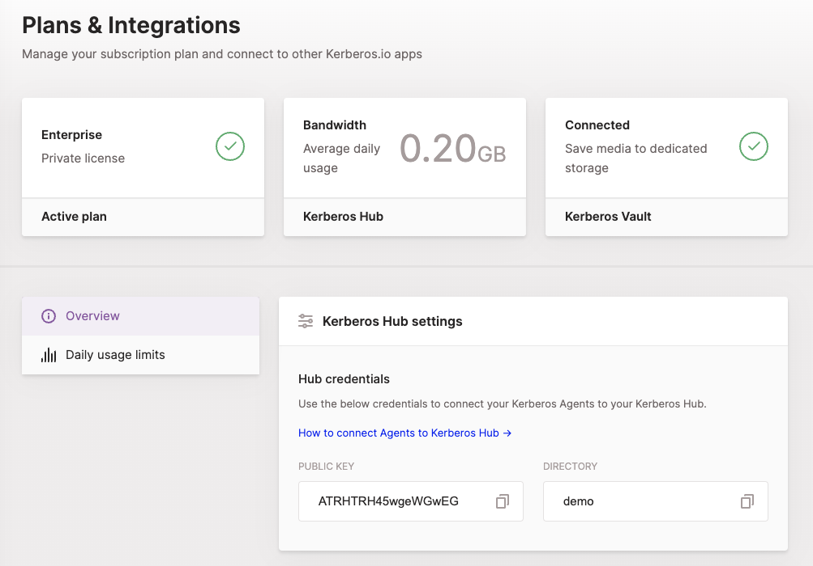

Next to the Kerberos Hub information we will also need details from other components that make up the Kerberos Enterprise Suite. We will need credentials from our MQTT broker, TURN server and Kafka broker. While moving forward we will configure Kerberos Vault and our Kerberos Factory and Kerberos Agents. We will come back at our Kerberos Hub application for a last minimal configuration step, but let's move forward for now.

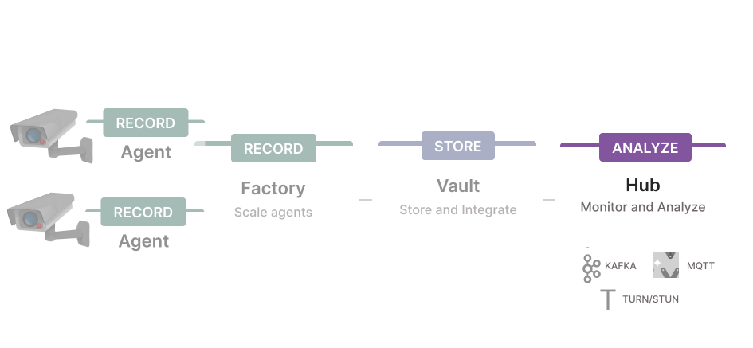

### MQTT

To communicate with your Kerberos Agents across different networks, a MQTT broker is required. If you are using our Kerberos Hub SAAS edition you can leverage following MQTT broker:

- tcp: `tcp://mqtt.kerberos.io:1883`

When running a self-hosted Kerberos Hub, make sure you have properly installed the MQTT broker (Vernemq) [by following the Kerberos Hub installation (Helm chart)](https://github.com/kerberos-io/hub#vernemq). [The default credentials](https://github.com/kerberos-io/hub/blob/master/vernemq/values.yaml) will look like this:

- tcp: `tcp://mqtt.domain.com:1883`
- wss: `wss://mqtt.domain.com:8443`
- username: `yourusername`
- password: `yourpassword`

If you are running a private edition of Kerberos Hub managed by the Kerberos.io team you will receive above information as part of the license contract.

### Kafka (optional)

Within Kerberos Hub we are leveraging multiple microservices which are tied a scalable message broker Kafka. As part of your installation you will be required [to setup a Kafka broker in your Kubernetes cluster](https://github.com/kerberos-io/hub#kafka). As we will show later, Kafka will be added as an integration in Kerberos Vault to push an event into Kafka everytime a recording is stored in the underlaying storage system. [The default credentials](https://github.com/kerberos-io/hub/blob/master/kafka/values.yaml) will look like this:

- host: `kafka1.domain.com:9094,kafka2.domain.com:9094`
- group: `mygroup`
- username: `Yourusername`
- password: `Yourpassword`
- mechanism: `PLAIN`
- security: `SASL_PLAINTEXT`
- topic: `kcloud-event-queue` 

If you are running a private edition of Kerberos Hub managed by the Kerberos.io team you will receive above information as part of the license contract. If you have purchased a Kerberos Hub SAAS subscription you can integrate with Kerberos Hub directly using your access keys, so no need to configure Kafka.

To debug your Kafka broker, and validate the connection is working we recommend to install [the Offset Explorer client](https://www.kafkatool.com/). This will give you more insights of what is happening inside Kafka. Next to that it is also possible to use Prometheus and Grafana to have a more consolidated and graphical view.

When setting up the Offset Explorer, you can use following configuration to setup your connection.

- Cluster name: a name of own choice
- Zookeeper Host: leave empty
- Zookeeper Port: leave empty
- Security: `SASL Plaintext`
- Advanced > Bootstrap servers: `kafka1.domain.com:9094,kafka2.domain.com:9094`
- SASL Mechanism: `PLAIN`
- JAAS Config: `org.apache.kafka.common.security.plain.PlainLoginModule required username="Yourusername" password="Yourpassword";`

### TURN server

A TURN server is required for high definition live streaming, by default only a low resolution is provided while using the MQTT broker. When using our Kerberos Hub SAAS edition you can use following information:

- stun: `stun:stun.l.google.com:19302`
- turn: `turn:turn.kerberos.io:8443`
- username: `username1`
- password: `password1`

When running a self-hosted installation you should make sure to have your TURN server configured on a stand-alone virtual machine. More information how to run our TURN server in a Docker container, [can be found here](https://github.com/kerberos-io/turn-and-stun).

If you are running a private edition of Kerberos Hub managed by the Kerberos.io team you will receive above information as part of the license contract.

## Kerberos Vault

Once we have above information we can start by setting up our Kerberos Vault, create storage provider and create an integration with our Kerberos Hub.

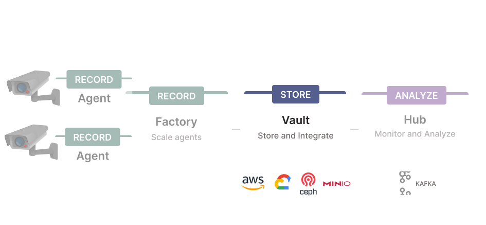

### Storage Provider 

Before starting you should have made a decision where you want to have your recordings stored. At the moment of writing we are supporting all S3 compliant providers such as: S3, Minio, Storj, Ceph, etc and Google Cloud Storage as well. To get a better understanding of how to setup and configure your storage provider [have a look at our providers page in the Kerberos Vault section](/vault/providers).

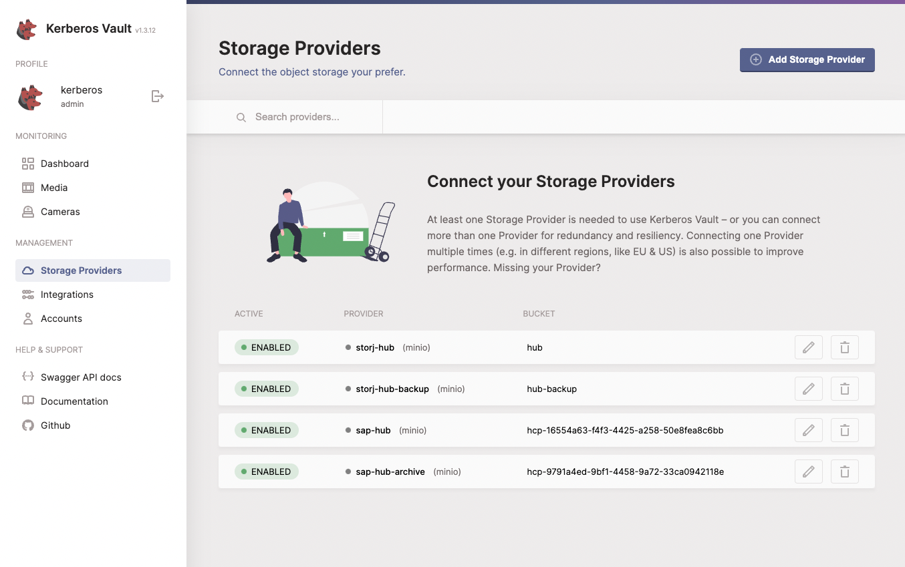

### Integration

Once you have your storage provider setup, we can create our integration, using the credentials we gather in previous section. We have different integrations to hook up Kerberos Vault to Kerberos Hub. The first one is a direct integration with the Kafka broker and the second one is through the Kerberos Hub API. You will only need one integration so you can choose one of them.

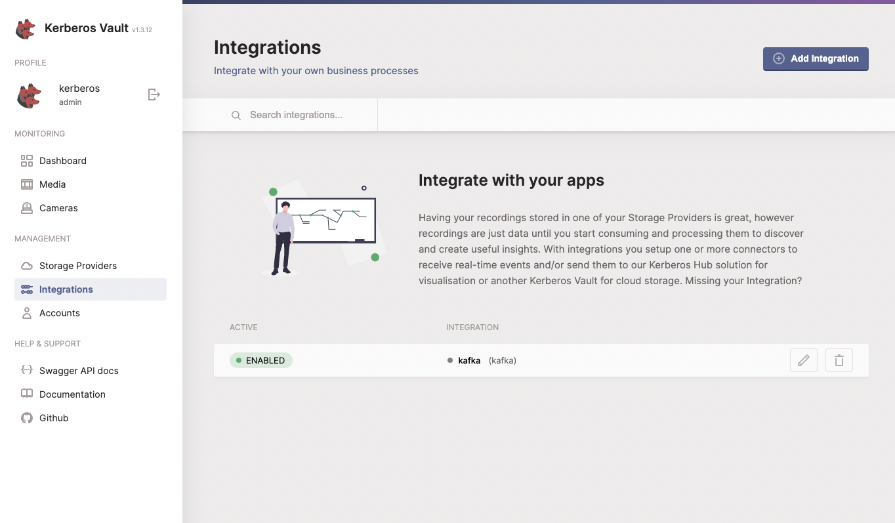

#### a. Kafka integration (self-hosted or private)

The most efficient is to integrate directly with Kafka, using the credentials we gather in previous section. On the integrations page of Kerberos Vault [you will find more information of how to configure](/vault/integrations/#kafka) and setup the Kafka integration. Make sure that you validate the connection.

Once testing the Kafka integration, you should see a message published in your Kafka broker. You can validate either by using Offset Explorer or Prometheus when having metrics enabled in the Helm chart.

#### b.  Kerberos Hub integration

If you have purchase a Kerberos Hub SAAS subscription or you don't like to use the Kafka integration you can leverage the Kerberos Hub integration. Under the hood it will still use Kafka to distribute to the different microservices. The advantage of the Kerberos Hub integration is that it will hide the Kafka configuration for you, or in the case of the Hub SAAS subscription not available to you at all.

You will find more information about [the Kerberos Hub integration here](/vault/integrations/#kerberos-hub).

### Account creation

To finish the Kerberos Vault installation we will need to create a security account so that both our Kerberos Agents and Kerberos Hub can connect to Kerberos Vault, for publishing new recordings and retrieving them for displaying in the Kerberos Hub interface.

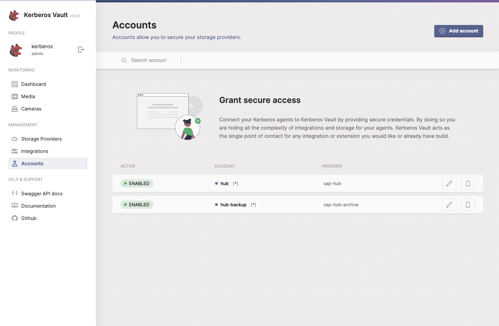

[Follow the accounts page in the Kerberos Vault section](vault/accounts/) to create a security account and retrieve some credentials. Important is to enable Cloud Analysis and leave Edge analysis disabled for a default installation. Once done we will collect following informations:

- Account name
- Access key
- Secret key
- Kerberos Vault API url (you retrieve this by opening the Swagger API docs in the left navigation)

We are done here, you know have setup your Kerberos Vault and linked it to Kerberos Hub. Next we will configure our Kerberos Agents and Kerberos Factory so that they will store recordings into your storage provider and trigger an event in Kerberos Hub so you will be able to see your recordings in a single pane of glass.

## Kerberos Factory

Yes, we are ready to hook up our Kerberos Factory and Kerberos Agents to Kerberos Vault and Kerberos Hub, so finally we are able to view some recordings. Let's get started.

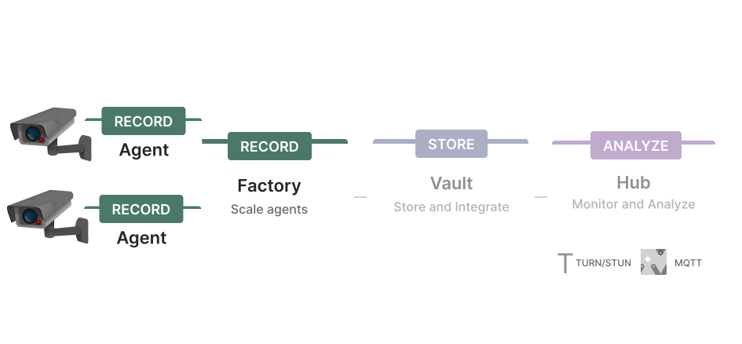

 When running the stand-alone agent go to the settings page of your Kerberos Agent, when running Kerberos Factory go to your Kerberos Factory portal and navigate to the Global settings. We will focus on Kerberos Factory for now as Kerberos Agent is similar but easier.

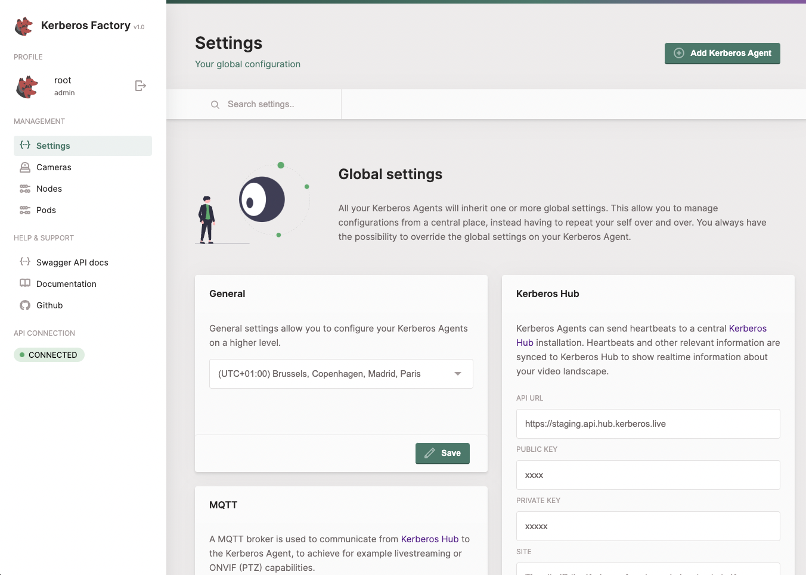

### MQTT

Search for the MQTT settings, and enter the MQTT settings you've collected in the first step.

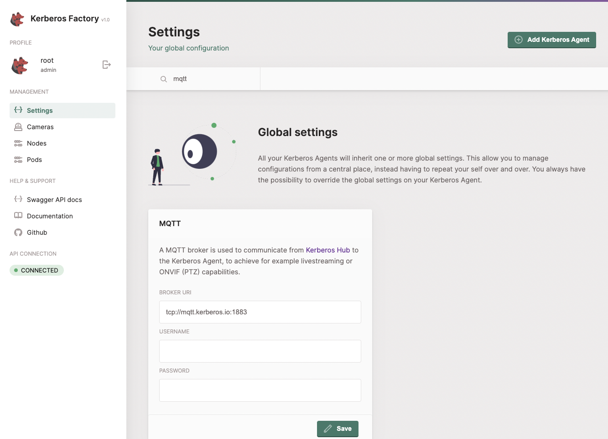

### TURN

If you want to retrieve HD streams, configure the TURN settings in your Kerberos Factory or Kerberos Agent. You can use a google STUN server or also add your own. 

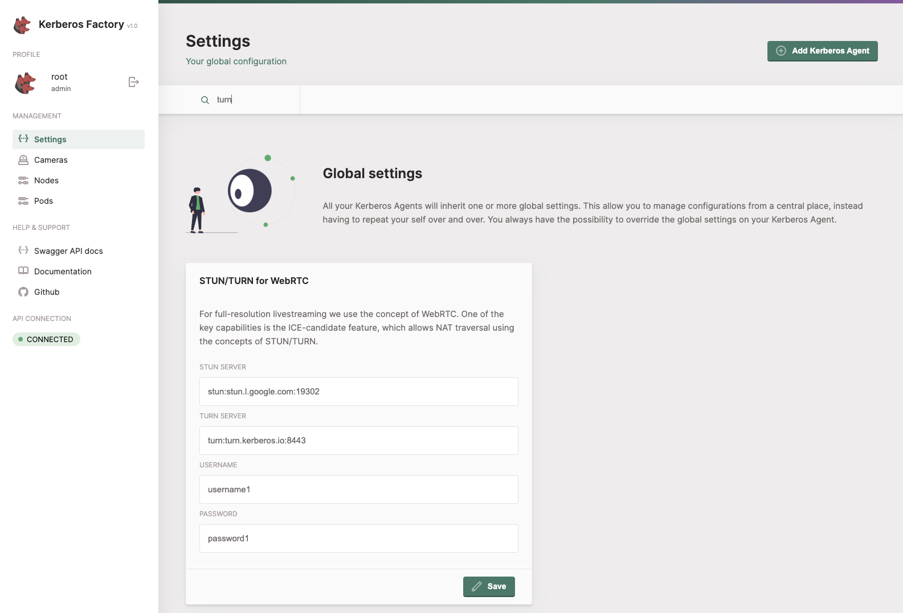

### Kerberos Hub

To connect your Kerberos Agent to your Kerberos Hub account, you'll need to provide the `API url` and `public key` that belongs to your Kerberos Hub account. Once provided your Kerberos Agents will start sending heartbeats to Kerberos Hub and your account, after a few seconds your agents should show up.

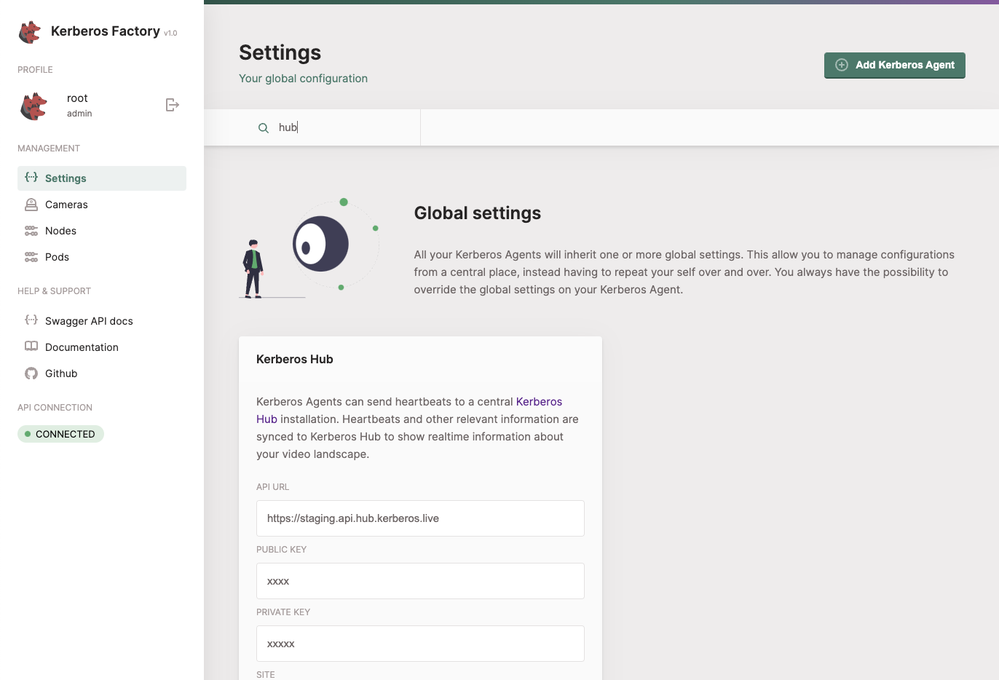

### Kerberos Vault

To have your recordings stored in Kerberos Vault, you'll need to setup the persistence settings. Select Kerberos Vault from the dropdown, and provide the credentials from your Kerberos Vault account.

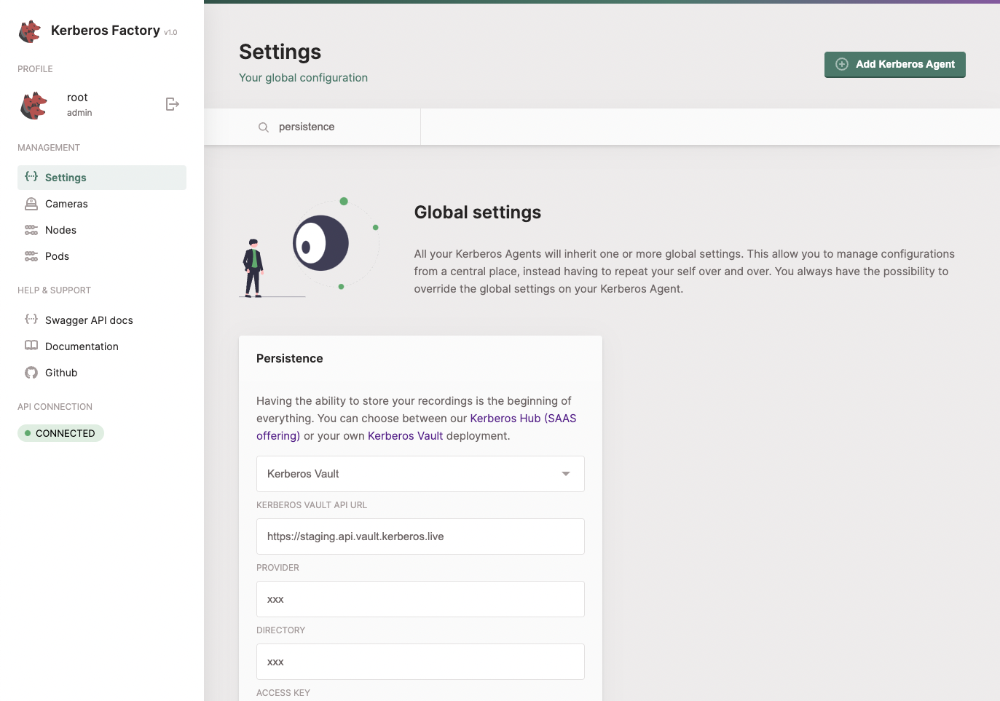

When everything works out you should see your Kerberos Agent popping up in the cameras section of your Kerberos Vault. 

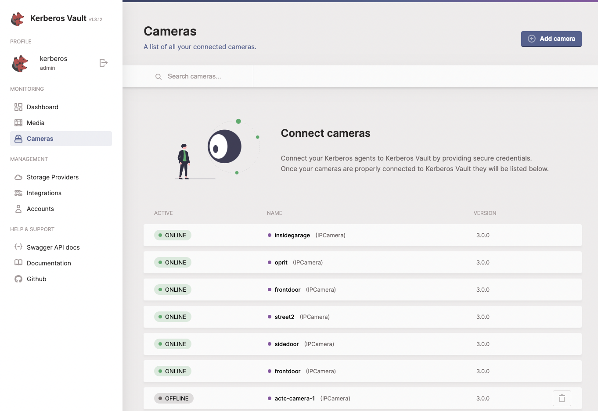

From now one all recordings made by your Kerberos Agents will also be send to Kerberos Vault and stored on the underlaying storage provider. On the media page you should see some recordings popping up.

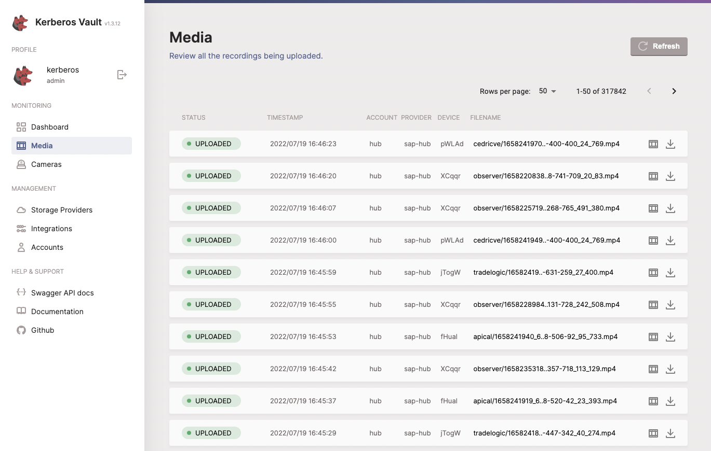

## Kerberos Agents

When using a stand-alone Kerberos Agent, without Kerberos Factory, you want to follow the same configuration as described previous section; Kerberos Factory.

For Kerberos Factory, you have the option to override your global settings at Kerberos Agent level. You do this by opening the `Edit` option of your Kerberos Agent. Within this modal you are able to change and override specific settings.

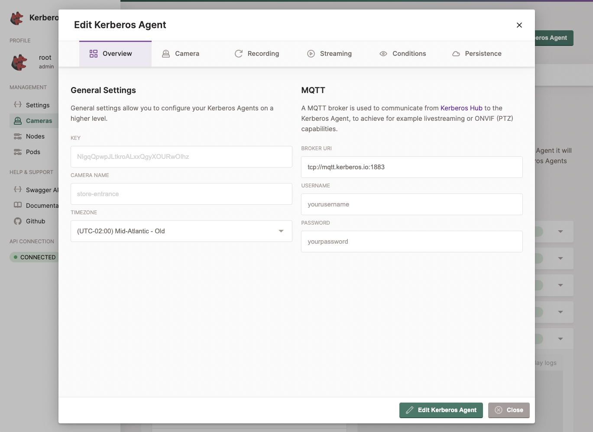

## Wrapping up

Hurray, we're almost ready. You should now see recordings popping up in your storage provider and Kerberos Vault. Next to that you should already see some Kerberos Agents on the cameras page of Kerberos Hub, and also recordings coming into the media page.

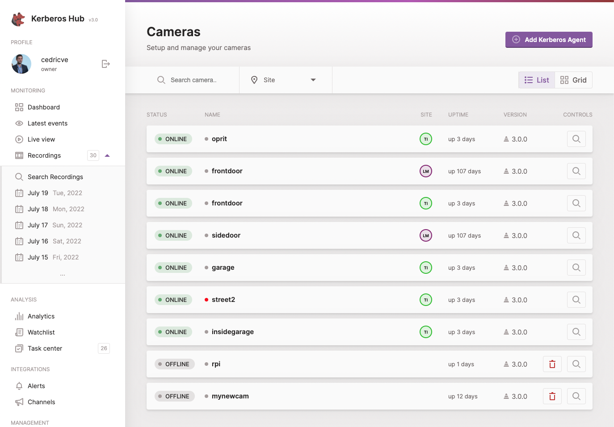

Before closing, this a last configuration is required in Kerberos Hub. At this stage everything is connected integrated, expect Kerberos Hub and Kerberos Vault. We have added an integration from Kerberos Vault to Kerberos Hub, but not from Kerberos Hub to Kerberos Vault.

You might wonder why? Well, next to sending a message from Kerberos Vault to Kerberos Hub to announce a new recording was stored, Kerberos Hub also need to permissions to visualises recordings managed by Kerberos Vault. Without these credentials Kerberos Hub will not be able to show any recording, and any microservices included in Kerberos Hub will be able to access the recordings. The main reason for this is security.

To fix this go and sign into your Kerberos Hub account; make sure you have the `owner` role. Navigate to the `Plans & Integrations` page, and scroll down until you see the Kerberos Vault section.

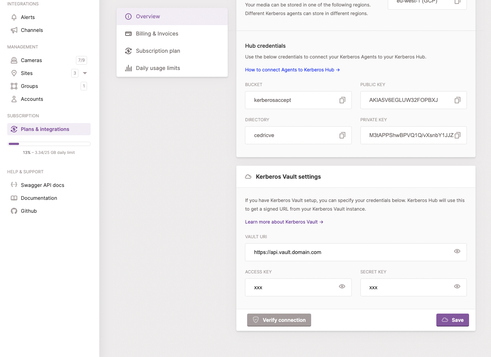

Add the `api url` of your Kerberos Vault and `access key` and `secret key` of your Kerberos Vault account. Verify connection and update your settings. Once done successfully navigate to the media page, and you should see your recordings popping up.

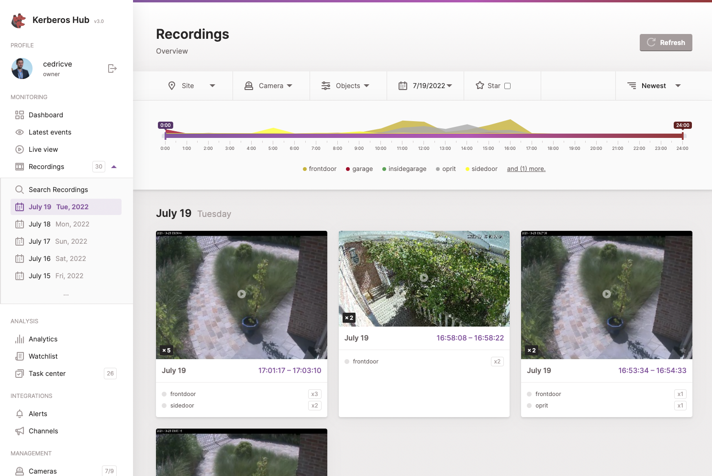

Congrats you made it!
