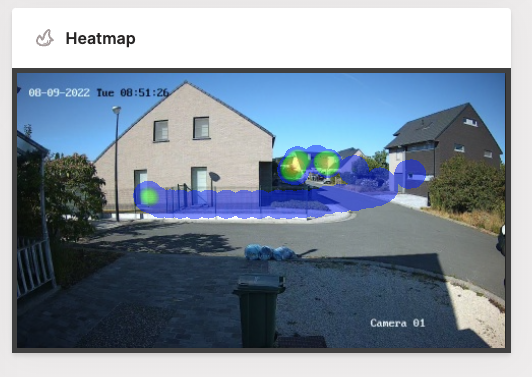
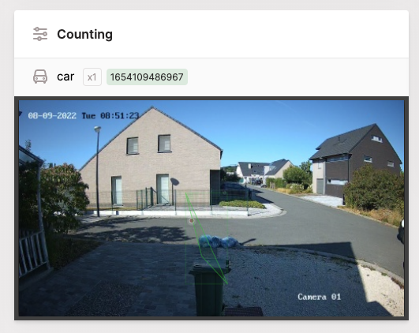
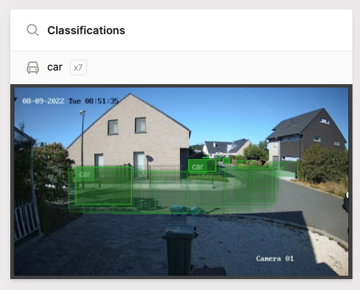
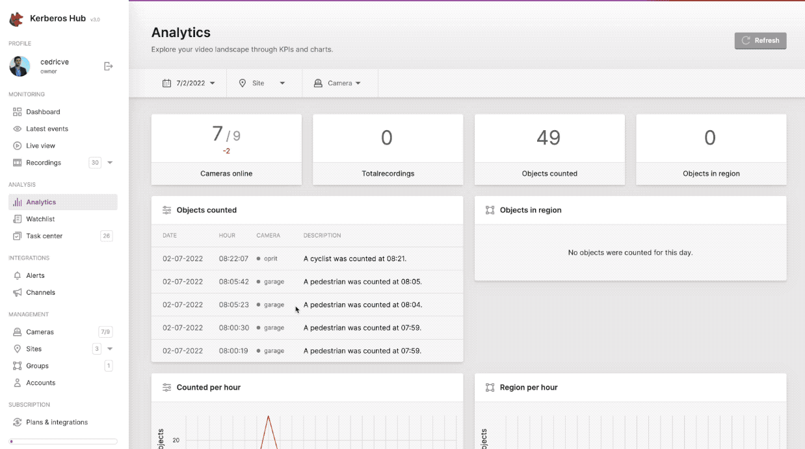

Kerberos Hub provides insights through video analytics. Recordings being uploaded to Kerberos Vault are triggering [the Kerberos Hub pipeline](/hub/pipeline/). Inside the pipeline, several computations are being done: sequencing, alerting and video analytics.  

Having said that, please note that [you can build your own pipeline by](/vault/machine-learning/) integrating with Kerberos Vault. For example you could create your own cat/dog detector and inject your own machine learning algorithms, or interface with your favorite data science solution stack.

So what can you expect from the video analytics in Kerberos Hub? It provides two types of analytics: CPU  and GPU enabled computations.

## CPU 

These analytics are running on a CPU, and don't require a GPU installed in one of your nodes, as they are rather simple analytics. Following calculations or computer vision algorithms are executed in the pipeline. This list is still growing over time, as the Kerberos.io team is advancing the Kerberos Hub solution day by day.

### Thumbnail

Creating thumbnails might not bring any insightful analytics, but it helps to get already a sneak peek or context of the recording before it is downloaded from your Kerberos Vault. This also saves some bandwidth as videos do not need to be preloaded when searching for a particular event.



A simple scale down function is being used and converted to a `base64` encoded image. This `base64` object is stored in the Kerberos Hub database.

### Dominant color

A color histogram is created for every the first frame of the recordings. The dominant color can be used for looking for specific objects of interest.



## GPU 

More complex analytics are calculated using a GPU. Specific machine learning models are loaded inside the GPU memory and predict specific objects, patterns and more. Post-processes (heatmap, counting, etc) can leverage the results of the classifications, and do a more specific calculation.

### Object detection and tracking

The classification service executes a YOLOv3 algorithm on the recorded media. Moving or stationary objects are located in the recording, while the traject of moving objects are computed. 



The GPU workload is not available in the Kerberos Hub pipeline by default, and requires to be installed seperately. More information about the installation of the `hub-objecttracker` can be found on our [Github page](https://github.com/kerberos-io/hub-objecttracker).

### Heatmap

The detected objects are displayed on a canvas when drilling down to the media page. On top of that a heatmap is shown which visualises the occurence of objects using a colormap.

### Counting 

The results of the object detection are passed to the counting service. Objects moving over a distance and crossing a line segment (defined in an alert) are counted.

### Region detection

One or more regions can be specified. Objects of interest moving in a region will trigger

## Analytics overview page

All analytics are consolidated on the analytics overview page. On this page you'll find an overview for each day, site and camera. The total number of recordings, number of counts and number of region detections are shown on a hour graph. For each camera the full-day heatmap is shown, which illustrates the most active zones of that specific day.

