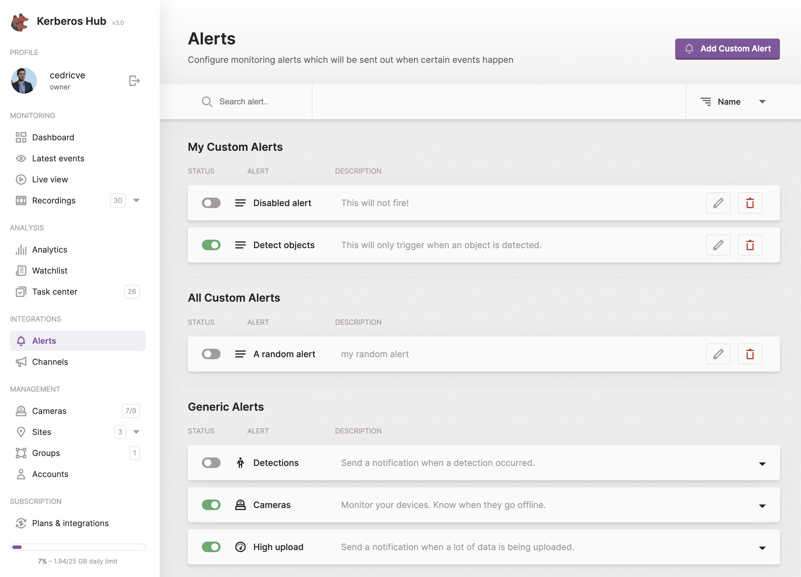

You might wonder what is inside the Kerberos Hub solution? We'll provide you a concrete list of functionalities below, this should give you more insights about how Kerberos Hub looks like and what the capabilities are.

## Bring your own storage

Kerberos Hub integrates with [Kerberos Vault](/vault/first-things-first), and makes your recordings available through a secure web interface. When using the Kerberos Hub Saas offering, your Kerberos Agents will connect to our Kerberos Vault Saas environment. This means that your recordings will be stored on your storage providers or on our if you are using the Saas version.



Within Kerberos Hub specific metadata is stored regarding the different recordings such as the name, filesize, classifications, etc. However, the actual recordings are in the storage provider you have selected (for example Minio, S3, etc) managed through Kerberos Vault. This means that the Kerberos Vault itself is decoupled from Kerberos Hub.

Kerberos Hub uses APIs and authentication to request recordings from the Kerberos Vault instance. 

## Consolidated overview

The [Kerberos Hub pipeline](/hub/pipeline) groups recordings, coming from one or more Kerberos Agents, into time sequences. The idea is to simplify the search for a specific event. Fewer recordings are shown at once, and when necessary you drill down to a level deeper to receive more details. 



In a few seconds you will see how many recordings were generated during a certain time period, which Kerberos Agents were involved, and the classifications predicted by a machine learning service.

### Signed urls

Once you're inside the Kerberos Hub application, you will see all available recordings of your Kerberos Agents in a single interface. So how does this work? We already know that Kerberos Vault is involved, but there something else happening as well.

Kerberos Vault is linked to one or more storage providers, to be more specific object storage, which can be hosted in the cloud or at the edge. So when a recording is requested from Kerberos Hub, Kerberos Vault will not download the recording from the relevant storage provider, but instead it will generate a signed url. This signed url is generated by the underlying object storage, and gives secure access to the recording itself. Kerberos Vault is responsible for generating that signed url and sharing it with Kerberos Hub, but it will not download the recording and serve it again (proxy). Instead, Kerberos Vault will share the signed url with Kerberos Hub. 

## Advanced searching

Next to showing your recordings in a single overview, we provide the capability to search for a particular event/recording more easily. For example, you can search for recordings within a specific time window, recordings generated by a specific Kerberos Agent, recordings which are marked as important, classified recordings such as pedestrians or animals, and more.



## Machine learning

Machine learning is a crucial part of the Kerberos Enterprise Suite. From Kerberos Hub and Kerberos vault, you can trigger different machine learning models, and even bring your own.

An out-of-the-box machine learning model that we apply is the YOLOv3 classification, which is part of the Kerberos Hub pipeline; read more about it at the [Github repo](https://github.com/kerberos-io/hub-objecttracker). All recordings being uploaded to Kerberos Vault will be interfered by the model, and have a prediction and metadata as a result. That information is stored into the Kerberos Hub application, and is used for features such as advanced search and notifications.

Next to classifying and predicting objects, the model is also tracing the classified objects. By doing this we can label the recording with the object of interest. More information about the analytical capabilities of Kerberos Hub can be [found on the analytics page](/hub/analytics).



## Integrations

When a specific event occurred, a notification can be send to one or more channels. A user can compose an event by selecting one or more conditions. Once the event is triggered, a notification is sent to all the enabled channels.

### Alerts

Kerberos Hub supports different types of alerts: generic alerts (1st generation) and customer alerts (2nd generation).

#### Generic alerts

Generic alerts are the first generation alerts we have in Kerberos Hub, they are less flexible then custom alerts and can only be configured once for the entire account. If you require the need to configure multiple alerts then customer alerts will be a better choice.

- **Detections**: send a notification if a recording was received from a specific Kerberos agent, within a time range, with a specific classification, etc.
- **Devices**: when one of your Kerberos Agents stops working, a notification will be sent.
- **High upload**: when a lot of recordings are generated within a specific period of time, a notification can be send.



#### Custom alerts

Custom alerts are the second generation alerts, and are designed to create multiple and different alerts to match different usecases. Custom alerts provide you with more capabilities then the generic alerts, such as counting lines and regions of interests.

As of this moment custom alerts are only available for detections, and not devices or high upload notifications (this is [on our roadmap](https://github.com/kerberos-io/roadmap/projects/2)).

### Channels

Kerberos Hub supports different types of channels, to which notifications can be sent:

- **Browser**: notifications inside the browser (if the used browser supports this).
- **E-mail**: a personal email can be send.
- **Slack**: send a message to a slack channel.
- **Alexa**: send a notification to Alexa skill ([Notify Me](https://www.amazon.com/Thomptronics-Notify-Me/dp/B07BB2FYFS)).
- **Telegram**: send a message to a Telegram channel.
- **Pushbullet**: send a message to a Pushbullet channel.
- **Pushover**: send a message to a Pushover channel.
- **Webhook**: trigger a webhook (POST).
- **IFTTT**: send a message to IFTTT.
- **SMS**: send a text message to a mobile number.



## Livestreaming

Kerberos Hub allows you to visualise live streams from your Kerberos Agents. A low and high resolution is made available.



### Low resolution

The low resolution livestream is a snapshot, JPEG, shared over MQTT (TCP) and visualised in the Kerberos Hub using secure websockets (WSS). No port forwarding needed to be enabled.

### High definition

The high definition livestream is made possible through WebRTC. The full resolution and FPS is sent through using the WebRTC technology. WebRTC has NAT traversal capabilities by using STUN and TURN servers, so no need for port forwarding as well.

## Accounts

It is possible to create multiple accounts (also called sub accounts) within your main account. A sub account can be granted access to one or more groups, sites or cameras.



## Sites and groups

You can structure your cameras across groups and sites. By creating sites, sub accounts get restricted access to specific cameras or groups of cameras. By grouping Kerberos Agents it is easier to filter recordings.


