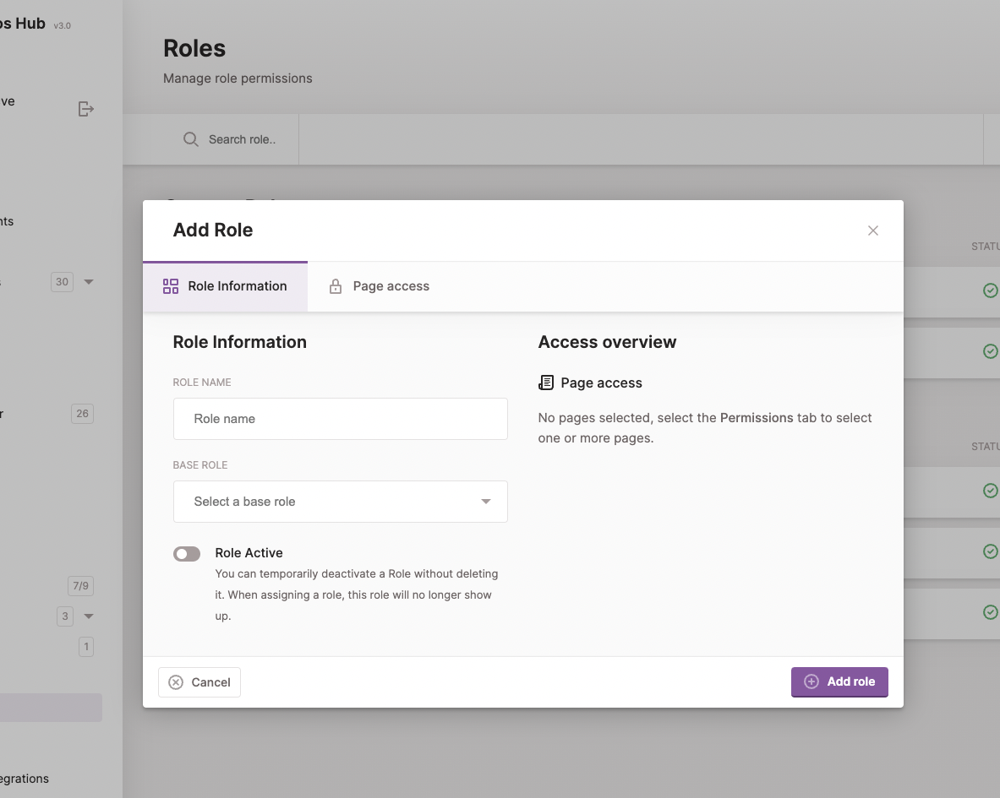
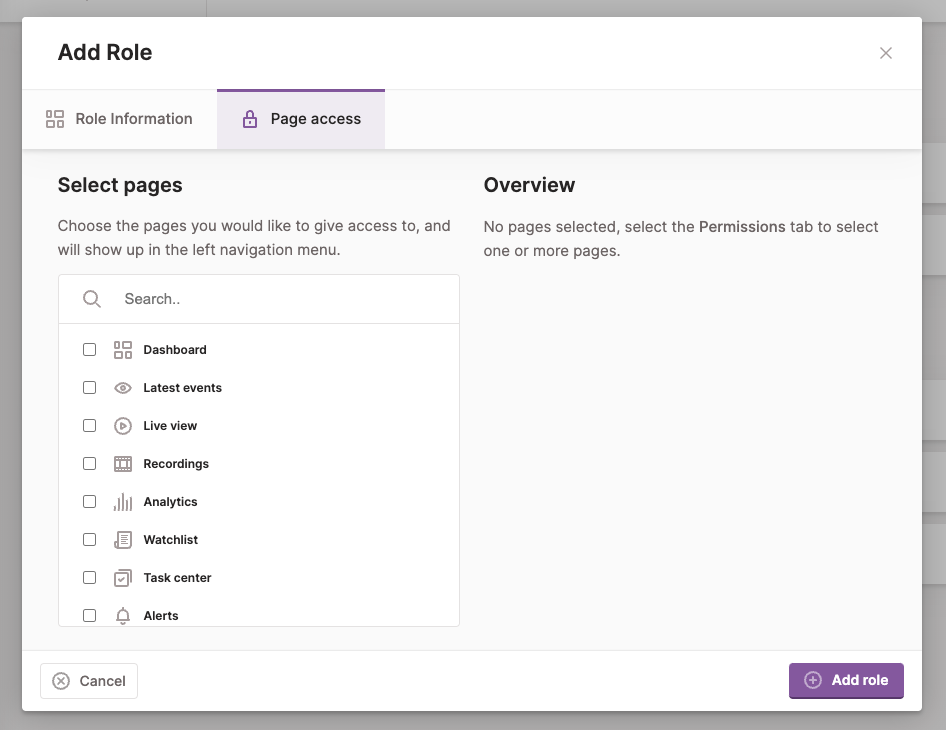

 
By default Kerberos Hub users are granted with the `owner` role, which grants the highest level of access. Using the `owner` role you have access to the Kerberos Hub credentials, modify the Kerberos Vault integration, create alerts and integrations, and more.

## Accounts

A Kerberos Hub user with the `owner` role, has the ability to create additional sub accounts or sub users. By creating additional users, the `owner` user can decide to delegate a subset of cameras and specify different access roles such as `admin`, `editor` or `guest`.

By creating a subaccount you have the option to specify the required role that should be sufficient for the user. When the user would login, the actions which can be executed are limited to the assigned role.

For example a `guest` user will not be able to modify any settings or create any alerts. An `admin` or `editor` will be able to create alerts, etc.

The access and rules for the different standard roles (`owner`, `admin`, `editor` and `guest`) are defined by the Kerberos Hub application, and cannot be modified. If you like to have more control over permissions you'll need to look into custom roles; read more below.

## Custom Roles

Next to the `owner` role and other roles `admin`, `editor` and `guest`, you have the option to add your custom role. A custom role gives you more fine grained user access, which allow you to disable specific function and features, and pages.

As of the time of writing, we currently are managing the access to the main navigation. More access will be added over time.

