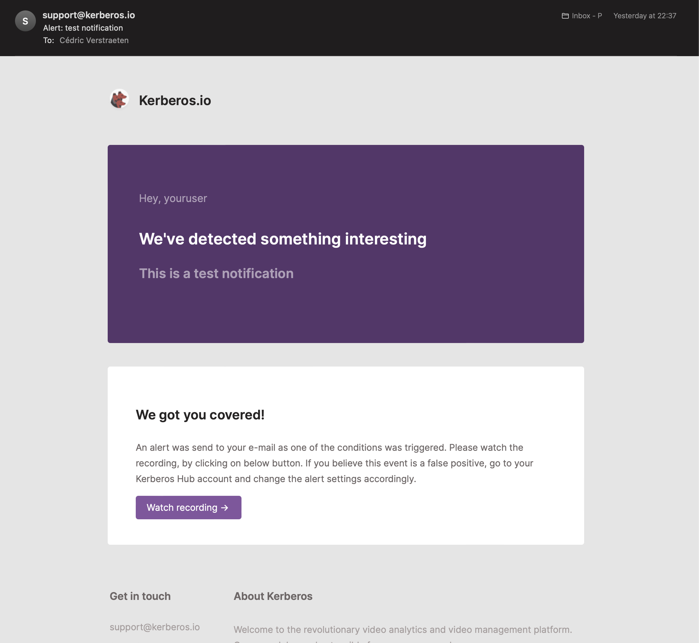

Kerberos Hub can be styled towards your company marketing branding and/or preferred style guides. By injecting a custom CSS file, and overriding our icon library, you can make Kerberos Hub feel like it's your own product; and we do not have any problem with that.

We believe that a consistent and streamlined company branding is important when using 3rd party applications in your companies ecosystem.

Next to styling Kerberos Hub yourself, we can also rebrand the application for your needs as part of the Kerberos Enterprise Suite license. In the end nothing stops you to perform the layout changes yourself, whenever you want.



## Overriding the Kerberos Hub styling

The recommended approach to add your custom styling is to inject a custom stylesheet file `.css` in the Kerberos Hub Front-end container. Let's start by creating a `.css` file, and include all the relevant CSS elements which you would like to modify. This could look like [this](https://github.com/kerberos-io/hub/blob/master/custom-layout/style.css).

    .app .sidebar.closed {
      background: red !important;
    }

To know which element you need to style, we advice [to use the inspect elements tool](https://developer.chrome.com/docs/devtools/open/#:~:text=When%20you%20want%20to%20inspect,the%20element%20and%20select%20Inspect.&text=Or%20press%20Command%20%2B%20Option%20%2B%20C,%2C%20Linux%2C%20Chrome%20OS) of your Chrome/Safari/Firefox browser developer tools.

Once you are happy with your styling, you can proceed with the injection in the front-end container.

Injection is done through the concept of Persistent Volumes (PV). A PV is mapped in a front-end container, and is overriding the local directory of the front-end container with your changes made in the PV. If you are not familiar with a PV, [you might need to learn about it first](<https://kubernetes.io/docs/concepts/storage/persistent-volumes/#:~:text=A%20PersistentVolume%20(PV)%20is%20a,node%20is%20a%20cluster%20resource.>).

Once you created a PV and uploaded your stylesheet, you should [create a Persistent Volume Claim (PVC)](https://github.com/kerberos-io/hub/blob/master/custom-layout/custom-layout-claim.yaml), so you can share it with the Kerberos Hub front-end container.

To share the PVC, you need to make a few changes in the Kerberos Hub Helm chart `values.yaml`. [Uncomment](https://github.com/kerberos-io/hub/blob/master/values.yaml#L210-L224) the `volumeMounts` and `volumes` properties. Change the PVC accordingly and keep the `mountPath` unchanged.

If all set, commit your changes by doing an `helm install` or `helm upgrade`.

## Custom logo

Similar to **overriding the Kerberos Hub styling** you can inject your own company logo as well. This logo will be used on the login page and sidebar once signed in. Make sure to name your company logo as following, `logo-sidebar.svg`.

To inject your logo, upload it into the same PV as you used for the custom styling.

## Custom icons

If you do not like the icons we are using, you can also modify those by injecting your own SVG icon library. An example of the icon library can be found here: [icon.js](https://github.com/kerberos-io/hub/blob/master/custom-layout/icons.js).

All icons are sorted in alphabetic order, and each icon has a generic naming convention and relevant SVG element.

Make sure you are using SVG icons, we do not support other formats at the moment of writing.

    (function(window) {
    window["env"] = window["env"] || {};
    window["env"]["svg"] = window["env"]["svg"] || {};

        /* Accounts */
        window["env"]["svg"]["accounts"] = `<svg class="icon" width="18" height="18" viewBox="0 0 18 18" fill="none" xmlns="http://www.w3.org/2000/svg">
        <path fill-rule="evenodd" clip-rule="evenodd" d="M9 2C7.89543 2 7 2.89543 7 4C7 5.10457 7.89543 6 9 6C10.1046 6 11 5.10457 11 4C11 2.89543 10.1046 2 9 2ZM5 4C5 1.79086 6.79086 0 9 0C11.2091 0 13 1.79086 13 4C13 6.20914 11.2091 8 9 8C6.79086 8 5 6.20914 5 4Z" fill="currentColor"/>
        <path fill-rule="evenodd" clip-rule="evenodd" d="M3.9981 11.3995C5.29471 9.88675 7.08937 9 9 9C10.9106 9 12.7053 9.88675 14.0019 11.3995C15.2944 12.9074 16 14.9238 16 17C16 17.5523 15.5523 18 15 18L3 18C2.44772 18 2 17.5523 2 17C2 14.9238 2.70558 12.9074 3.9981 11.3995ZM9 11C7.72803 11 6.47044 11.5882 5.51662 12.701C4.75666 13.5877 4.24797 14.743 4.07017 16L13.9298 16C13.752 14.743 13.2433 13.5877 12.4834 12.701C11.5296 11.5882 10.272 11 9 11Z" fill="currentColor"/>
    </svg>`

        /* Activity / pulse (Latest Activity) */
        window["env"]["svg"]["activity"] = `<svg class="icon" width="18" height="18" viewBox="0 0 18 18" fill="none" xmlns="http://www.w3.org/2000/svg">
        <path fill-rule="evenodd" clip-rule="evenodd" d="M9.92677 0.00271038C10.4021 -0.03219 10.836 0.273183 10.9635 0.732382L13.094 8.40217L13.4453 8.16798C13.6096 8.05846 13.8026 8.00003 14 8.00003H17C17.5523 8.00003 18 8.44774 18 9.00003C18 9.55231 17.5523 10 17 10H14.3028L13.0547 10.8321C12.7879 11.0099 12.4521 11.0491 12.1515 10.9374C11.851 10.8256 11.6223 10.5766 11.5365 10.2677L10.3729 6.07887L8.99228 17.1241C8.93316 17.597 8.54854 17.9624 8.07323 17.9973C7.59793 18.0322 7.16404 17.7269 7.03648 17.2677L4.90599 9.59789L4.5547 9.83208C4.39043 9.94159 4.19742 10 4 10H1C0.447715 10 0 9.55231 0 9.00003C0 8.44774 0.447715 8.00003 1 8.00003H3.69722L4.9453 7.16797C5.21207 6.99013 5.54794 6.95098 5.84846 7.0627C6.14898 7.17442 6.37771 7.42346 6.46352 7.73238L7.62707 11.9212L9.00772 0.875991C9.06684 0.403086 9.45146 0.0376109 9.92677 0.00271038Z" fill="currentColor"/>
    </svg>`

    ...

## Custom favicons

Favicons are injected into the container just like the custom stylesheet, logo and icons. The only difference is that they are not stored in the `custom` directory, but are stored in the `favicons` directory. An example of the [favicons content can be found here](https://github.com/kerberos-io/hub/tree/master/custom-layout/favicons).

To make this work an additional `volumeMount` has to be created and relevant PVC. Once you've done that you will see your own favicons appear.

## Custom email templates

Within the Kerberos Hub application different events and notifications are send; for example below email. Notifications are send upon different events such as account creation, forgot password, event detection (object found in a region or crossing a counting line), etc.

.

As Kerberos Hub can be whitelabeled, you can bring your own email templates and styled them similar to the Kerberos Hub interface. By doing so you will have an uniqiue styling for the entire Kerberos Hub application.

Within Kerberos Hub we use a couple of different [email templates](https://github.com/kerberos-io/hub/tree/master/custom-layout/templates), which are used in different scenarios (as described above). For each template there is a `.txt` and `.html` which respectively provides the email in a text-only mode and for the latter a designed email that the email client is able to render.

Email templates are injected into the container just like the custom stylesheet, logo and icons. The only difference is that they are not stored in the `custom` directory, but are stored in the `templates` directory. An example of the [email templates can be found here](https://github.com/kerberos-io/hub/tree/master/custom-layout/templates).

To make this work an additional `volumeMount` has to be created and relevant PVC. The `volumeMount` needs to be pointed to `/mail/templates`. Once you've done that you will see your own email templates appear.

To activate and inject your email templates, make sure to uncomment the `volumes` and `volumeMounts` in the `values.yaml` inside the `kerberoshub.api`, `kerberospipeline.notify` and `kerberospipeline.notifyTest`.

    kerberoshub:
        api:
            ...
            schema: "https"
            url: "api.yourdomain.com"

            # E-mail templates
            volumeMounts:
              - name: custom-email-templates
                mountPath: /mail
            volumes:
              - name: custom-email-templates
                persistentVolumeClaim:
                  claimName: custom-layout-claim
    kerberospipeline:
        ...
        notify:
            ...
            # E-mail templates
            volumeMounts:
            - name: custom-email-templates
                mountPath: /mail
            volumes:
            - name: custom-email-templates
                persistentVolumeClaim:
                claimName: custom-layout-claim
        notifyTest:
            ...
            # E-mail templates
            volumeMounts:
            - name: custom-email-templates
                mountPath: /mail
            volumes:
            - name: custom-email-templates
                persistentVolumeClaim:
                claimName: custom-layout-claim

Within en email template you can use variables, which are indicated through `{{variable}}`. Each variable will be automatically replaced by the required value. Following variables can be used in your email template.

- `{{user}}`: user that triggered the message
- `{{text}}`: text of the message
- `{{link}}`: link to the media (recording)
- `{{thumbnail}}`: image (either a base64 or a url).
- `{{classifications}}`: list of classifications detected in the recording.
- `{{timezone}}`: timezone of the account generating the event
- `{{date}}`: date of the media
- `{{time}}`: time of the media
- `{{datetime}}`: datetime of the media
- `{{eventdate}}`: date of the notification
- `{{eventtime}}`: time of the notification
- `{{eventdatetime}}`: datetime of the notification
- `{{devicename}}`: device generating the event
- `{{deviceid}}`: device generating the event
- `{{sites}}`: the list of sites the device is part of
- `{{groups}}`: the list of groups the device is part of
- `{{numberOfMedia}}`: number of media attached to the message
- `{{dataUsage}}`: data usage of the message
