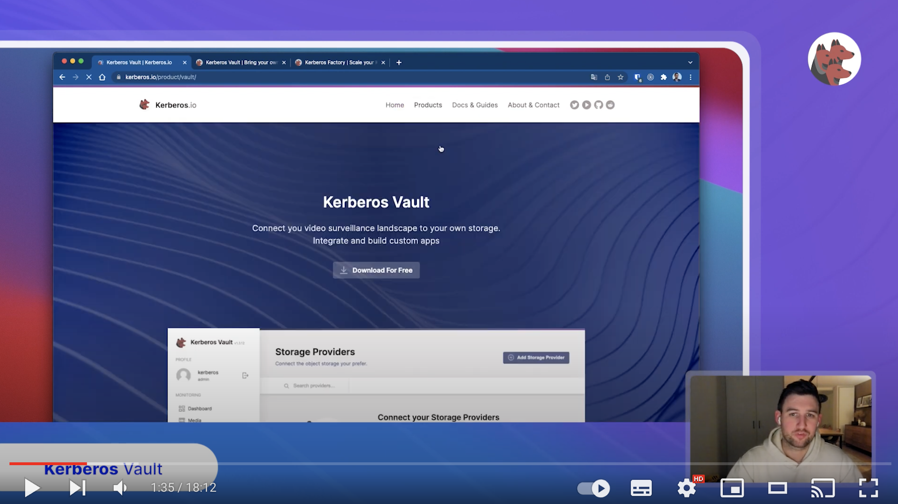

It all starts with your Kerberos Agents. You might set up one or more agents at several locations, sites, rooms, offices, etc. Each Kerberos Agent will monitor a particular video stream and persist recordings on a local disk; taking into account the specific conditions such as region of interest, time window, etc.

While growing your video landscape, and adding more and more Kerberos Agents, it will become interesting, and probably also required to have a central place of storage. That central place might be at the edge, in the cloud, or both depending on the uses.



That central storage place is what we call Kerberos Vault. It allows you to store your data wherever you want, and let you integrate with any kind of process such as machine learning, event systems, CCTV monitoring, etc.

## Kerberos Vault in a nutshell

Kerberos Vault is a solution where you Bring Your Own Storage (BYOS). It allows you to configure the storage providers you want, and makes it possible to connect consuming applications such as [Kerberos Hub](/hub/first-things-first), Machine learning models, Kafka brokers, etc. As discussed before, these so-called storage providers can live in the cloud such as Amazon Web Services S3, Google Cloud Platform Storage, Storj, or reside at the edge such as Minio or Ceph.

Despite the flexible storage capabilities, Kerberos Vault is also an open platform, which can be used to build extensions (mobile apps, web apps, machine learning services, etc) and integrations. It allows you to leverage a scalable and stable system as a strong backbone for your video analytics solutions, machine learning algorithms, and more.

## Storage Providers

When deploying Kerberos Agents you have the possibility to Bring Your Own Storage; at the edge or in the cloud. By configuring Kerberos Vault you persist your recordings in your preferred storage providers. Following providers are supported:

- [Google Cloud Platform Storage](https://cloud.google.com/storage)
- [Amazon Web Services S3](https://aws.amazon.com/s3/)
- [Storj](https://storj.io/)
- [Minio](https://min.io/)
- [Ceph](https://ceph.io/)

When installing Kerberos Vault in a cloud environment, following architecture may apply. Your Kerberos Agents are running at the edge, but uploading to Kerberos Vault in a cloud environment.



On the other hand you could also have Kerberos Vault running at the edge, next to your Kubernetes Enterprise agents. This could be useful if you want to do processing or video analytics such as computer vision or machine learning at the edge. Find more information about storage providers [on the providers page](/vault/providers).



## Integration and Events

One of the key differentiators, is the ability to extend and integrate. Next to uploading and persisting recordings on your preferred storage providers, Kerberos Vault can trigger events and be configured through APIs.

Each time a Kerberos Agent sends a recording to Kerberos Vault, it is persisted on a storage provider, and an event is triggered through one of the following integrations.

- [Apache Kafka](https://kafka.apache.org/)
- [Amazon Web Services SQS](https://aws.amazon.com/sqs/)
- [Kerberos Hub](/hub/first-things-first/)
- Kerberos Vault (remote forwarding)

Every time an event is delivered, it will be consumed by the configured integrations. For example in case of a Kafka
integration, one can build a Kafka consumer with custom application logic; a notification manager, a machine learning
service, etc. Find more information about events and integrations on [the integrations page](/vault/integrations).



## Machine learning and Computer Vision

Kerberos Vault allows scaling machine learning and computer vision algorithms through the concept of queueing, decoupling of Kerberos Agents to recordings and the NVidia Kubernetes Operator.

Kerberos Agents send recordings to Kerberos Vault. Every time a recording is stored, the Kafka integration is producing an event in a Kafka topic. A machine learning or computer vision consumer is reading from a Kafka topic, downloads the relevant recording from Kerberos Vault, and starts a prediction or execution of an algorithm on one or more GPUs.

By combining the intelligence of making recordings in small chunks, and distributing them across multiple GPUs, we allow you to scale your machine learning or computer vision independent of the number of video streams. Learn more about developing your own [machine learning model or computer vision algorithm](/vault/machine-learning/).



## Remote forwarding and chaining

Multiple Kerberos Vaults can be installed in your video landscape. You may have Kerberos Vaults at the edge and/or in a cloud environment, connected to edge and/or cloud storage providers.

Kerberos Vaults can be chained and configured in forwarding mode. This configuration makes it possible to enable offline capabilities and keep the majority of your recordings at the edge. Only a subset of your recordings will be transferred from the edge to the cloud by requesting a forward from Kerberos Hub or building your own forwarding application code.



An example of remote forwarding is a machine learning filter. Recordings are stored in a Kerberos Vault at the edge, and are processed by a machine learning model. Every time the machine learning model finds a match, e.g. a pedestrian detected, it will forward the recording to Kerberos Vault in a cloud environment. By doing this you will send limited recordings (storage) into the cloud. Find more information about forwarding on [the forwarding page](/vault/forwarding).

## Open API

All Kerberos products ship with Swagger APIs, which can be used to communicate with, configure and start specific actions of the related solution. Simply type `/swagger/index.html` at the end of the url, and a Swagger UI will be shown. There is no need to explain the different APIs, use the Swagger and see what is available.



## Licensing

Kerberos Vault is shipped as a binary in a Docker container and is licensed through the MIT license. The source code is closed, and maintained by the Kerberos.io development team.
