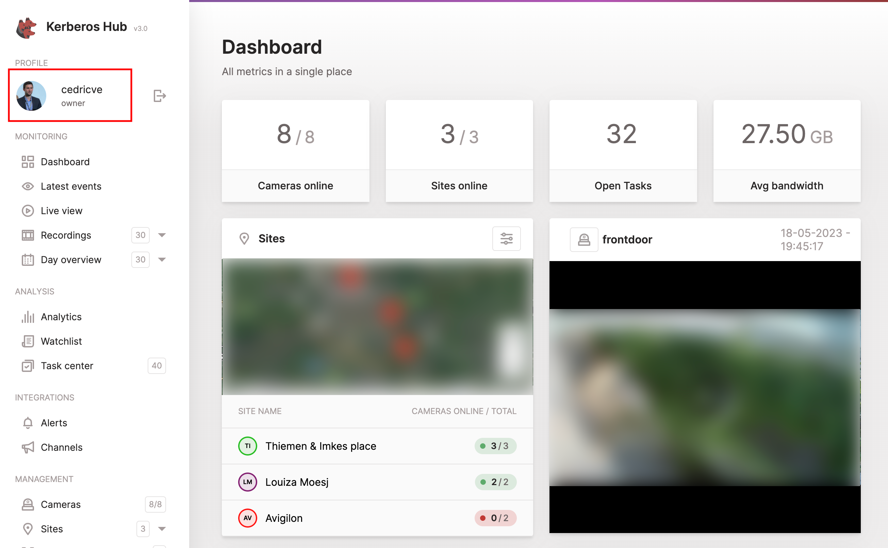
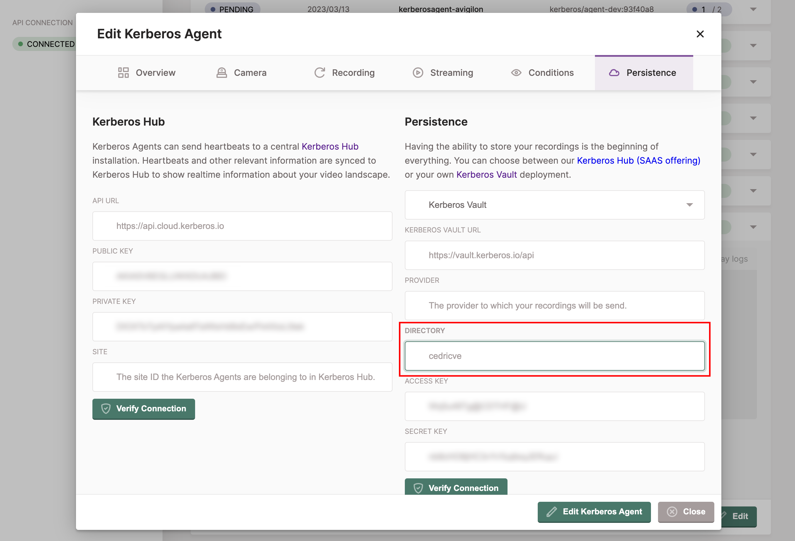
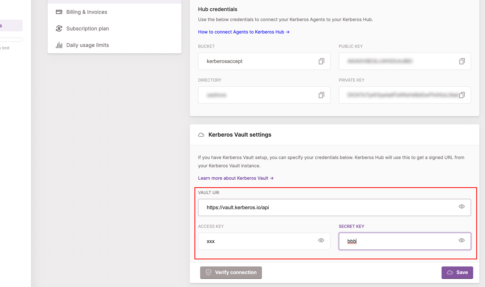

One of the key differentiators, is the ability to extend and integrate. Next to uploading and persisting recordings on your preferred storage providers, Kerberos Vault can trigger events and be configured through APIs.

Each time a Kerberos Agent sends a recording to Kerberos Vault, it is persisted on a storage provider, and an event is triggered through one of the following integrations.

- [Apache Kafka](https://kafka.apache.org/)
- [Amazon Web Services SQS](https://aws.amazon.com/sqs/)
- [Kerberos Hub](/hub/first-things-first/)
- Kerberos Vault (remote forwarding)

Every time an event is delivered, it will be consumed by the configured integrations. For example in case of a Kafka
integration, one can build a Kafka consumer with custom application logic; a notification manager, a machine learning
service, etc.

## Prerequisites

Before you can configure a provider, make sure [you have installed a Kerberos Vault](/vault/installation) inside a Kubernetes cluster.

## Configuration of an integration

Once you have set up your Kerberos Vault instance, and have successfully login to the application, you should see the integration navigation item on the left.



When selecting the `+ Add Integration` button, a modal will open that allows you to configure a specific integration. Go a head and select one from the list.



Once completed the necessary credentials, specific to your integration, you can verify the connection by click the `Validate` button. If ok, it should return a `green` confirmation box, if something went wrong you should see the relevant error message in a `red` alert box. When completed you can add multiple and different integrations.

## Cloud event integrations

Kerberos Vault integrates with queues and message brokers in the cloud such as AWS SQS. The advantage is that it takes the complete control of your every growing messaging/event requirements.

### AWS SQS

> Tutorial to be written.

## Edge event integrations

Alternatives to cloud event integrations are self-hosted variants such as a Kafka broker.

### Kafka

Apache Kafka is an open-source distributed event streaming platform used by thousands of companies for high-performance data pipelines, streaming analytics, data integration, and mission-critical applications.

To integrate a Kafka broker with Kerberos vault you could install your existing Kafka installation, or on board a new Kafka broker inside your Kubernetes cluster. Before installing the Kafka broker, we will need to set up a storage class. As previously mentioned we will use OpenEBS for that, but you could use the storage class you prefer.

    kubectl apply -f https://openebs.github.io/charts/openebs-operator.yaml

Once OpenEBS is installed and configured, go ahead with setting up the Kafka broker.

    kubectl create namespace kafka
    helm install kafka bitnami/kafka -f https://raw.githubusercontent.com/kerberos-io/vault/master/yaml/kafka/kafka.values.yaml -n kafka

Once done you should see the relevant kafka pods and zookeeper being deployed

    kubectl get po -n kafka

Now you are ready to configure the Kerberos Vault integration, by selecting the Kafka option. You should add the Kafka credentials and authentication mechanism.



- Integration name: this a preferred name for the integration.
- Broker: the url of the broker `kafka.kafka:9092`.
- Group: the group to which messages are produced, this can be any value you want.
- Topic: the topic to which a message is produced, if the topic doesn't exist, it will be created automatically.
- Username: the username, `Yourusername`.
- Password: the password, `Yourpassword`.
- Mechanism: the kafka mechanism, `PLAIN`.
- Security: the kafka security, `SASL_PLAINTEXT`.

## Kerberos integrations

Next to third party integrations such as Kafka or AWS SQS, it is possible to integrate with a remote Kerberos Vault, also called chaining or forwarding or with Kerberos Hub.

### Kerberos Vault

Kerberos Vaults can be chained and configured in forwarding mode. This configuration makes it possible to enable offline capabilities and keep the majority of your recordings at the edge. Only a subset of your recordings will be transferred from the edge to the cloud by requesting a forward from Kerberos Hub or building your own forwarding application code.



To learn more about how to enable the Kerberos Vault integration, have [a look at the forwarding page]().

### Kerberos Hub

The Kerberos Hub integration allows you to visualise your recordings, stored in your Kerberos Vault, in you Kerberos Hub account. By using the integration, events are send to [the Kerberos Hub pipeline](/hub/pipeline) and visualised in the Kerberos Hub interface. Each time a recording is uploaded to Kerberos Vault, an event is sent to the REST API of Kerberos Hub, and injected in the Kerberos Hub pipeline. The Kerberos Hub pipeline will start evaluating the recording and generate various metadata.



- Integration name: this a preferred name for the integration.
- Kerberos Hub Url: the url to the API of Kerberos Hub, `https://api.your.hub.com`
- Hub Key: this is the cloud key that is assigned to your user (owner accounts), by default this is `AKIAxxxxxxG5Q`.

#### Kerberos Hub username

When creating a Kerberos Hub account and linking it to your own Kerberos Vault, you have to make sure the Kerberos Hub username is matching the Kerberos Agent destination directory. If this not matching, your recordings will not be shown in the Kerberos Hub interface.

Once you logged in, or created an account, you will see your Kerberos Hub username at the left top of the navigation. You have to make sure this username, equals the directory field of the Kerberos Agent (or Kerberos Factory settings).

Make sure the `directory` field of your Kerberos Agents or Kerberos Factory is configured with the Kerberos Hub username.

#### Kerberos Vault credentials

Once you have added the integration to Kerberos Vault, and made sure the Kerberos Hub account name matches the Kerberos Agent directory field, you should see some recordings landing into your Kerberos Hub account. However to view your recordings in Kerberos Hub, you'll need to add your Kerberos Vault credentials to your Kerberos Hub account (or installation).

As you are the owner of the Kerberos Vault, you'll need to make Kerberos Hub (SAAS or self-hosted) aware of where your Kerberos Vault is located (DNS name) and the Kerberos Vault account you have used.

As soon as you have configured the Kerberos Vault settings in your Kerberos Hub account, you'll should be able to open the recordings and view them in the application. Note that you are in full control (and the owner) of your recordings, so once you change the Kerberos Vault credentials or your disconnect the Kerberos Vault, you won't be able to view the recordings in Kerberos Hub anymore.
