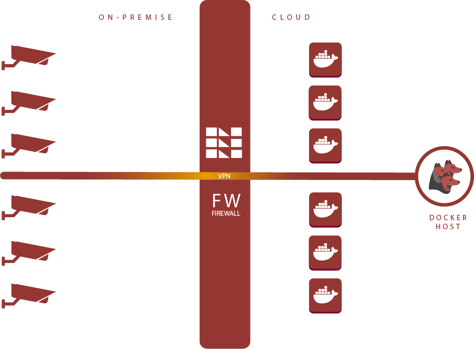

# Architectures

In this section we will explain some usecases and best practices, which might help you to define the architecture that fits your needs.

> Please read the [introduction page](/) first, before moving forward.

When starting with Kerberos you might ask yourself, how should I deploy these so called, Kerberos agents? Well, there are different options. You can install a Kerberos agent on a Raspberry Pi, VM, Server or even in a Kubernetes cluster. So what should you do, and when? Let's have a closer look at the different options.

The first thing you need to consider is the environment, in which you want to deploy your Kerberos agents. Is it inside your house, your company or at a public place? Another important factor is the number of surveillance cameras you would like to monitor, and if you have any high availability requirements.

## Agents on-premise

The most common scenario is to install your Kerberos agents on-premise. This has a couple of benefits such as latency, bandwidth and a less complex security model. When installing a Kerberos agent on-premise, you have a couple of different options.

### Kerberos Open Source (< 5 Kerberos agents)

If you have a limited number of surveillance cameras you would like to monitor, and don't have any high availability requirements, the Kerberos Open Source agent is a good choice. For example, you can install the Kerberos Open Source agent on a Raspberry Pi, by using [KiOS](opensource/installation#kios), [Raspbian OS](opensource/installation#raspbian) or compile it from source.

On below architecture, a couple of Kerberos agents are installed on-premise (inside the local network). A Kerberos agent is installed for each surveillance camera, and each Kerberos agent runs on a seperate host (Raspberry Pi, VM, etc). The web interface of the Kerberos agents can be reached from the internal network, but cannot be accessed from the cloud.

Another option to install the Kerberos Open Source agent is to use Docker. Instead of having seperate hosts for each Kerberos agent, you will have a single host (Docker host) with multiple Docker containers. A Docker container is deployed for each surveillance camera, which contains the software to run the Kerberos agent.

Running your Kerberos agents inside Docker containers, allows you to process multiple surveilllance cameras using only one host.

### Kerberos Enterprise (> 5 Kerberos agents)

When working within an enterprise context, where you require high availability and have a large amount of surveillance cameras being monitored, [Kerberos Enterprise](/enterprise/introduction) is a good choice. Im comparison to the Open Source version, Kerberos Enterprise will use Kubernetes to help you scale (and secure) your security landscape. Kerberos agents, or Kubernetes deployments, are deployed inside your cluster and load balanced over the different nodes. When a Kerberos agent dies, or the node on which the deployment is running, Kubernetes will reschedule it to another healthy node.

## Agents in the cloud

Instead of processing your surveillance cameras on-premise you could also process them in the cloud. There are a couple advantages, for example, you don't have to manage your owner hardware, you can simply spin up a VM on one of the hyperscalers.

When dealing with Kerberos agents in the cloud, the complexity starts with the security model. As your surveillance cameras are running somewhere on-premise, you will need to make them available to your Kerberos agents, which are running in the cloud. There are several ways to do that, such as port forwarding (not recommended) or setting up a site-to-site VPN (recommended).

When setting up a VPN connection you will expose your surveillance cameras to your Kerberos agents. Once you've configured the Kerberos agents, data will flow through this secure tunnel, from on-premise to your cloud enviroment.

### Kerberos Open Source (< 5 Kerberos agents)

If you have a limited number of surveillance cameras you would like to monitor, and don't have any high availability requirements, the Kerberos Open Source agent is a good choice. You can install the Kerberos Open Source agent on Docker. Instead of having seperate VM's for each Kerberos agent, you will have a single VM (Docker host) with multiple Docker containers. A Docker container is deployed for each surveillance camera, which contains the software to run the Kerberos agent.

### Kerberos Enterprise (> 5 Kerberos agents)

Similar to [Kerberos Enterprise](/enterprise/introduction) on-premise, you can run the a Kubernetes in the cloud. The exact same solution is available, only the way how you connect to your video surveillance cameras will be different, as they will probably live in a different network. To make this work you will need to setup a VPN tunnel (or whatever your security teams have defined as a back practice). When [Kerberos Enterprise](/enterprise/introduction) is deployed to the cloud, it can be used any where. Public cloud (AWS, Google, Azure, etc) or private cloud. You can run it where you want.

## Kerberos Cloud

Once you've configured one of the previously mentioned architectures, you will have one or more Kerberos agents running, in the cloud or on-premise.

The Kerberos Open Source agent comes with a web interface, which makes it possible to review the activity for that specific agent; they don't have a consolidated overview. This means that you will need to open multiple web interfaces, one for Kerberos agent. In contrary Kerberos Enterprise agents, don't come with a web interface, therefore the Kerberos Cloud (public or private edition) is recommended.

To simplify this process and resolve some other challenges, Kerberos Cloud was developed.

> [Kerberos Cloud](https://cloud.kerberos.io) is a cloud solution which allows you to have a single overview of all the media recordings generated by your surveillance cameras. It's not a solution for processing your surveillance cameras in the cloud. For processing of your surveillance cameras, a Kerberos agent is used.

A brief list of the key features of Kerberos Cloud are:

- Secured storage
- Consolidated overview
- Advanced searching
- Machine learning
- Alerts
- Live streaming
- Accounts
- Logging

> Checkout [the demo environment](https://app-demo.kerberos.io) to see and feel the Kerberos Cloud solution yourself.

### Architecture

A simplified architecture is found below. In this architecture the Kerberos agents are installed on-premise (but this could also be in the cloud), next to the surveillance cameras. Once one of the agents recorded something it will send the recording to our AWS S3 bucket, using the credentials you've defined inside the agent.

As soon as the recording is succesfully received several engines will be executed, that will further process the recording and extract metadata from it (classification, origin of the surveillance camera, etc). A lot of processing is happening behind the scenes.

By using a browser you can navigate to Kerberos Cloud, and review all the recordings made by the Kerberos agents on-premise. On top of that you will receive more context about the recordings, get notifications, view a livestream and much more. Read more about [Kerberos Cloud here](/cloud).

