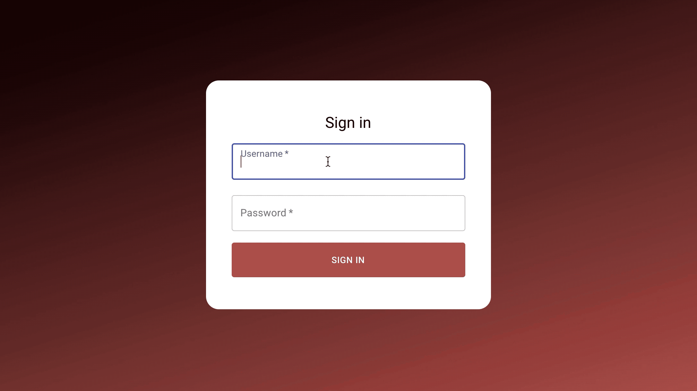
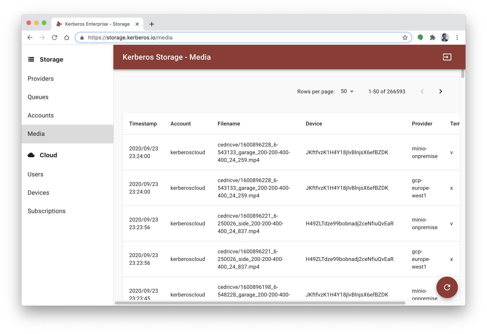

# Get Started

Once you've installed Kerberos Storage, you will have the Kerberos Storage web app running. This web app allows you to administrate Kerberos Storage. You can add storage providers, queues, accounts, and more from a single interface. Isn't that great.

Despite exposing a web app, Kerberos Storage also ships with a number of API's. These API's are exposed as, Swagger documentation, and can be used for extension and integration usecases. Think about following usecase..

> Having a couple of Kerberos Enterprise clusters installed, you could bring the recording of all your recordings at a single place. Next to that you would like to process every single recording being uploaded.

Having storage is just one thing, processing it with your own programming logical is what makes value.

> Using the concept of Queues, you could integrate with a Kafka queue, and receive real-time messages everytime a recording wa succesfully uploaded. Starting to process the different messages, you know which recordings were uploaded, and you can request the raw recording from Kerberos Storage, using one of it's API's. You could do with the recording what you want, in the programming language you prefer, and send the outcome of for example your highly customized machine learning algorithm to your own video analytics hub.

A [concrete tutorial can be found here](https://github.com/kerberos-io/storage/tree/master/examples/kafka-handler), it explains how to connect to Kerberos Storage, and run a color detection algorithm.

## Login page

Once you open a browser, and navigate to the Kerberos Storage web app (see installation for the URL), you will land on the login page.

The default username and password of the Kerberos Storage app is:

- username: **root**
- password: **kerberos**

> The username and password can be changed in the `deployment.yaml` file.

## License key

The first time you login you are asked for a license key, this can be obtained by sending a request to cedric@verstraeten.io, more information will be shared publicly soon. An example license key looks like this:

> -----BEGIN LICENSE KEY-----
L/+DAwEBB2xpY2Vuc2UB/4QAAQIBB1BheWxvYWQBCgABCVNpZ25hdHVyZQEKAAAA
/9z/hAFUPBAADG1haW4uTGljZW5zZf+BAwEBB0xpY2Vuc2UB/4IAAQIBB0NvbXBh
bnkBDAABB0V4cFRpbWUBBAAAABb/ghMBCmtlcmJlcm9zaW8B/MC7ZzIAAf+AOaJ+
8eU3OlZCphr4uJyH/PzfuDkMrqyfIsutc5kSz3rjsRtU4e6vETpHre8CPvFyx5w2
0O8PKCIR4z1q28qJK2cvHQTK0/zf+KfYLilEcmNczLXgg+bnPvtA/bU/K8ZEwbnw
Rta3+8zId+xtYQApdmHwo/Ih/vCN579iDeunwVQA
-----END LICENSE KEY-----

Once you received a license key, and entered it into the web app you will be redirected to the login screen. Enter your credentials again, and you will land on the providers page (read more about it in the next chapter).

## Providers

Providers are the actual datasource where you want to store your recordings. These providers could be a storage provider in the cloud or a storage provider on premise.  By adding a provider, you have to provide credentials that allow Kerberos Storage to store recordings in that specific provider. Following provider are currently supported. You can choose from:

  - [Google Cloud Platform Storage](https://cloud.google.com/storage)
  - [Microsoft Azure Storage](https://azure.microsoft.com/en-us/services/storage/)
  - [Amazon Web Services S3](https://aws.amazon.com/s3/)
  - [Minio](https://min.io/)

As explained before, for each provider, the appropriate security settings has to be filled in. For example for AWS you need to define the access and secret key, for GCP you need to define a service account.

Additionaly a provider can be marked as temporary. This is helpful if you wish to store your recordings for a short period, and want to use it for processing purpose only. A benefit of doing this is reducing costs (if you host in the public cloud).

## Queues

Events or messages are generated each time a recording was uploaded to Kerberos Storage. These messages can be send to one ore more message brokers such as Apache Kafka or AWS SQS. From the interface you can setup the connection, and once configured events will flow to your predefined message brokers.

An example or usecase of Queues is already discussed at the beginning of this page. Another usecase is the development of our Kerberos Cloud offering. Each time a Kerberos Cloud customer is sending recordings to his or her Kerberos Cloud profile, it is stored inside Kerberos Storage, and [thus in one of our predefined providers](/storage/get-started#providers). After storing successfully, a real-time message is send into our private Kafka broker, which is starting a chain of processing in sequence but also in parallel:

  - Metadata storage in MongoDB,
  - Notifications,
  - Classification with Tensorflow,
  - Counting algorithms,
  - and much more.

## Accounts

Having setup a `Provider` and a `Queue`, you also need to configure an account to interact with Kerberos Storage in a safe context. Creating an account allow you to do this. An account is the access point for end users to interact with your Kerberos Storage instance. On the Account page you can create one or more accounts and specify credentials for authentication and specific setting for authorization.

  - Allowed providers,
  - Provider directory
  - Public Key,
  - Secret Key,
  - Day limit (the number of days a recording is stored.)

So just a short recap, an account allows something or someone to interact with Kerberos Storage, and store data in the authorized `Providers` and in an directory, the `Provider directory`, inside that `Provider`.

As explained before, you can choose in which directory, the `Provider directory`, an account can store the recordings. By defining a  `Provider directory` you limit an account to have only access to this directory. On the other hand if you want to give an account more flexibility, and thus grant more access, you can use the `*` value for the `Provider directory` parameter. The latter will allow an account to write, in any subdirectory in the `Provider`.

Once an account is created it can be used in Kerberos Enterprise (and soon Kerberos Open Source) to persist your data from your Kerberos Enterprise agent into your own `Provider`.

## Media

Once a recording is stored inside a specific `Provider` it will show up on the `Media` page. The `Media` page is an overview, list page, of all your recordings being uploaded to a `Provider`. It is used for quickly reviewing activity as for recycling, for the latter read more at the next paragraph.

## Recycle

Storing recordings in a `Provider` is one thing, making sure you manage the storage capacity of your `Provider` properly is also important. Storage might need to be recycled after a while because of several reasons:

- maybe the data is no longer relevant,
- due to security or compliance,
- reducing costs, etc.

To make this possible Kerberos Storage comes with a configurable recycle deployment, which you can run next to your Kerberos Storage deployment. [Learn more about recycling here](/storage/installation-recycle).
